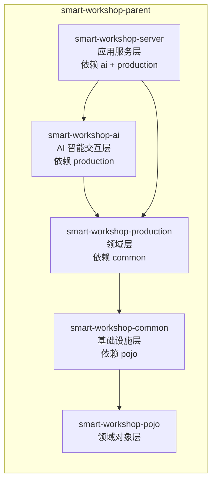
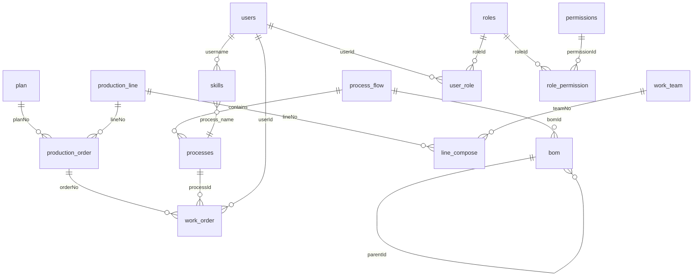

# 智能车间轻量级 MES 系统 —— 概要设计说明书

> **版本**: v1.1  
> **日期**: 2026-06-13  
> **项目**: Smart Workshop Lightweight MES System (Backend)

---

## 目录

1. [引言](#1-引言)
2. [系统概述](#2-系统概述)
3. [技术架构](#3-技术架构)
4. [模块设计](#4-模块设计)
5. [核心业务设计](#5-核心业务设计)
6. [数据库设计概要](#6-数据库设计概要)
7. [接口设计规范](#7-接口设计规范)
8. [安全架构](#8-安全架构)
9. [部署视图](#9-部署视图)
10. [附录](#10-附录)

---

## 1. 引言

### 1.1 编写目的

本文档旨在对**智能车间轻量级 MES（Manufacturing Execution System，制造执行系统）**后端进行概要设计，明确系统的整体架构、模块划分、核心业务流程、接口规范以及关键技术选型，为后续详细设计和开发实施提供依据。

### 1.2 系统背景

本系统面向中小型制造企业的车间现场管理需求，解决从**生产计划 → 生产订单 → 工单**三级生产调度与执行跟踪问题。系统提供基础的物料清单（BOM）管理、工艺流程管理、设备管理、产线编组管理、基于角色的访问控制（RBAC）权限体系，以及 AI 智能交互——用户通过自然语言即可完成数据查询与操作。

### 1.3 设计目标

| 目标 | 说明 |
|------|------|
| **轻量化** | 单体 Spring Boot 应用，降低部署和运维复杂度 |
| **状态可追溯** | 全生命周期状态机 + 审计日志，所有状态变更可追溯 |
| **级联联动** | Plan → Order → WorkOrder 三级级联，状态自动同步 |
| **权限可控** | RBAC 权限模型，粒度到接口级别的权限编码校验 |
| **业务门禁** | 关键动作前进行产能、工艺、技能三级门禁校验 |
| **AI 智能交互** | 自然语言驱动的 MES 操作，SSE 流式响应，注解驱动工具扩展 |

### 1.4 术语定义

| 术语 | 英文 | 说明 |
|------|------|------|
| 生产计划 | Plan | 顶层生产任务，定义生产什么、多少、何时完成 |
| 生产订单 | Order | 分配给具体产线的生产指令，是 Plan 的分解 |
| 工单 | WorkOrder | 最细粒度的执行单元，分配给具体工序和员工 |
| BOM | Bill of Materials | 物料清单，定义产品的组成结构 |
| 工艺流程 | ProcessFlow | 产品生产的工序步骤和顺序 |
| 产线编组 | LineCompose | 产线与班组的关联关系及技能矩阵 |
| 技能矩阵 | Skill Matrix | 员工-工序的技能匹配关系 |
| RBAC | Role-Based Access Control | 基于角色的访问控制 |
| AI Agent | AI Agent | 接收自然语言输入、调用 LLM 进行意图识别与决策、执行工具调用的智能调度组件 |
| Function Calling | Function Calling / Tool Use | LLM 根据用户意图选择并触发预定义的 MES 业务函数的技术能力 |
| SSE | Server-Sent Events | 服务器向客户端单向推送流式数据的 HTTP 协议，用于 AI 流式响应 |
| Tool Definition | Tool Definition | 以 JSON Schema 格式描述的工具定义，使 LLM 理解系统可用的操作及其参数约束 |

---

## 2. 系统概述

### 2.1 系统定位

本系统是智能车间的后端服务，提供 RESTful API 供前端（Web/移动端）调用。系统采用**单体多模块**的 Maven 工程结构，内部按领域划分为五个子模块，部署时合并为单个 Spring Boot 可执行 JAR。

### 2.2 核心业务能力

```
┌──────────────────────────────────────────────────────────┐
│                      MES 核心域                            │
│                                                          │
│   ┌──────────┐    ┌──────────┐    ┌──────────┐          │
│   │   Plan   │───▶│  Order   │───▶│WorkOrder │          │
│   │  生产计划  │    │  生产订单  │    │   工单   │          │
│   └──────────┘    └──────────┘    └──────────┘          │
│         │               │               │                │
│         ▼               ▼               ▼                │
│   ┌──────────────────────────────────────┐              │
│   │         状态机 + 审计 + 级联            │              │
│   └──────────────────────────────────────┘              │
│                                                          │
│   ┌──────────┐  ┌──────────┐  ┌──────────┐             │
│   │   BOM    │  │ Process  │  │Equipment │             │
│   │ 物料清单  │  │  工艺流程  │  │   设备   │             │
│   └──────────┘  └──────────┘  └──────────┘             │
│                                                          │
│   ┌──────────┐  ┌──────────┐  ┌──────────┐             │
│   │  团队     │  │  产线     │  │ 工作步骤  │             │
│   │  Team    │  │  Line    │  │ WorkStep │             │
│   └──────────┘  └──────────┘  └──────────┘             │
│                                                          │
├──────────────────────────────────────────────────────────┤
│                      支撑域                               │
│   ┌──────────────────┐  ┌──────────────────┐            │
│   │   RBAC 权限系统    │  │   认证（JWT）     │            │
│   │ User/Role/Perm   │  │  LoginFilter     │            │
│   └──────────────────┘  └──────────────────┘            │
├──────────────────────────────────────────────────────────┤
│                    智能交互域                              │
│   ┌──────────────────────────────────────────────────┐   │
│   │  AI Agent · LLM Provider · Tool Executor         │   │
│   │  自然语言 → 意图识别 → 工具调用 → 业务执行           │   │
│   └──────────────────────────────────────────────────┘   │
└──────────────────────────────────────────────────────────┘
```

---

## 3. 技术架构

### 3.1 技术栈

| 层次 | 技术选型 | 版本 |
|------|---------|------|
| 语言 | Java | 21 |
| 框架 | Spring Boot | 3.5.7 |
| 构建工具 | Maven | ≥3.9 |
| ORM | MyBatis + PageHelper | Spring Boot Starter |
| 数据库 | MySQL | — |
| 认证 | JWT (HS256) | jjwt 0.12.6 |
| 日志 | SLF4J + Logback | — |
| 流式响应 | SSE (SseEmitter) | Spring MVC 原生 |
| LLM API | Claude / OpenAI API | HTTP SSE 流式调用 |
| HTTP 客户端 | RestClient | Spring 6 原生 |
| 工具库 | Lombok, Jackson | — |

### 3.2 架构分层

采用经典的**分层架构**（Layered Architecture）：

```
┌─────────────────────────────────────────────┐
│           表示层 (Controller)                 │  智能车间-server
│   RESTful API · 参数校验 · 异常映射            │
├─────────────────────────────────────────────┤
│           服务层 (Service)                    │  智能车间-server
│   业务逻辑 · 状态管道 · 级联联动                │
├─────────────────────────────────────────────┤
│           领域层 (Domain)                     │  智能车间-production
│   状态机 · 权限策略 · 门禁策略 · StateContext   │
├─────────────────────────────────────────────┤
│           基础设施层 (Infrastructure)         │  智能车间-common
│   JWT工具 · 类型处理器 · 全局异常处理 · CORS    │
├─────────────────────────────────────────────┤
│           领域对象层 (POJO)                   │  智能车间-pojo
│   Entity · DTO · VO · Enum · Result          │
└─────────────────────────────────────────────┘
```

### 3.3 Maven 模块依赖关系



### 3.4 包结构规范

所有代码位于 `com.xtax` 包下，各子模块的职责划分：

| 模块 | 包路径 | 内容 |
|------|--------|------|
| pojo | `com.xtax.entity` | 数据库实体类（17个） |
| pojo | `com.xtax.dto` | 数据传输对象（11个） |
| pojo | `com.xtax.vo` | 视图对象 · Result · ResultPage（10个） |
| pojo | `com.xtax.enums` | 枚举：StateEnum · ActionEnum |
| common | `com.xtax.config` | CorsConfig |
| common | `com.xtax.exception` | BusinessException · SecurityException · globalExceptionHandler |
| common | `com.xtax.utils` | JwtUtils · JsonToMapTypeHandler |
| production | `com.xtax.stateDomain` | 状态机 · StateContext |
| production | `com.xtax.plicy` | GatePolicyInterface · PermissionPolicy（接口） |
| server | `com.xtax.annotation` | @RequirePermission · Logical |
| server | `com.xtax.audit` | AuditService |
| server | `com.xtax.config` | WebConfig |
| server | `com.xtax.controller` | 17个控制器 |
| server | `com.xtax.filter` | LoginFilter |
| server | `com.xtax.interceptor` | PermissionInterceptor |
| server | `com.xtax.mapper` | 17个 MyBatis Mapper 接口 |
| server | `com.xtax.plicy` | GatePolicy · 3个 PermissionPolicy 实现 |
| server | `com.xtax.service` | 14个服务接口 + 17个服务实现 |
| ai | `com.xtax.ai.annotation` | @AiTool · @ToolParam 注解 |
| ai | `com.xtax.ai.config` | AiProperties（LLM/会话/限流配置） |
| ai | `com.xtax.ai.controller` | AiChatController · AiAuditController · AiMetricsController |
| ai | `com.xtax.ai.entity` | AiChatSession · AiChatMessage · AiAuditLog |
| ai | `com.xtax.ai.dto` | SendMessageRequest · SessionCreateRequest · AiAuditQueryParam |
| ai | `com.xtax.ai.enums` | SessionStatus · MessageRole · SseEventType |
| ai | `com.xtax.ai.mapper` | 3个 Mapper + XML 映射文件 |
| ai | `com.xtax.ai.service` | AiSessionService · AiAuditService · AiMetricsService |
| ai | `com.xtax.ai.agent` | AiProvider · AiAgentService · ToolRegistry · ToolExecutor · ToolHandler · 2个 Provider 实现 |
| ai | `com.xtax.ai.tool` | 15个工具实现（按领域分包：equipment/bom/process/workstep/line/production/team） |

---

## 4. 模块设计

### 4.1 领域对象层（smart-workshop-pojo）

#### 4.1.1 生产核心实体

```
┌──────────┐     ┌──────────────────┐     ┌──────────┐
│   Plan   │────▶│ ProductionOrder  │────▶│WorkOrder │
│  生产计划  │     │     生产订单      │     │   工单   │
├──────────┤     ├──────────────────┤     ├──────────┤
│ planNo   │     │ orderNo          │     │workOrderNo│
│ planName │     │ planNo (FK)      │     │ orderNo(FK)│
│ bomId    │     │ lineNo (FK)      │     │ processId │
│ planNum  │     │ orderName        │     │ userId    │
│ completed│     │ quantity         │     │ isCritical│
│ startTime│     │ quantityProduced │     │ plannedQty│
│ endTime  │     │ qualifiedProducts│     │ actualQty │
│ priority │     │ defectiveProducts│     │ scrapQty  │
│ status   │     │ status(StateEnum)│     │ status(StateEnum)│
│ creatorId│     │ actualStart/End  │     │ start/End Time│
│ publisher│     │ start/End Time   │     │ actualStart/End│
└──────────┘     └──────────────────┘     └──────────┘
```

#### 4.1.2 主数据实体

```
┌──────────┐   ┌───────────────────────────────────────────┐
│   BOM    │   │              ProcessFlow                   │
│  物料清单  │   │               工艺流程                      │
├──────────┤   ├───────────────────────────────────────────┤
│ id       │   │ id                                        │
│ parentId │   │ bomId (关联产品)                             │
│ drawingNo│   │ flowName                                   │
│ nameSpec │   │ plannedWorkingHours                        │
│ material │   │ status                                     │
│ quantity │   └──────────────┬────────────────────────────┘
│ unitWgt  │                  │ 包含
│ type     │                  ▼
└──────────┘   ┌───────────────────────────────────────────┐
               │               Processes                    │
               │                工序                        │
               ├───────────────────────────────────────────┤
               │ id · processName · plannedWorkingHours     │
               │ qualityControlPoint                        │
               │ inputBomId(List) · outputBomId(List)       │
               │ workStepId(List)                           │
               └──────────────────┬────────────────────────┘
                                  │ 关联
                                  ▼
               ┌───────────────────────────────────────────┐
               │               WorkStep                     │
               │               工作步骤                       │
               ├───────────────────────────────────────────┤
               │ id · name · equipmentId · functionId       │
               │ equipmentName · equipmentModel             │
               │ functionDescription · description          │
               │ processName(List)                          │
               └───────────────────────────────────────────┘
```

#### 4.1.3 产线与团队实体

```
┌──────────────┐       ┌──────────────┐       ┌──────────────┐
│ProductionLine│──────▶│  LineCompose │◀──────│   WorkTeam   │
│    产线       │       │   产线编组    │       │    班组       │
├──────────────┤       ├──────────────┤       ├──────────────┤
│ lineNo       │       │ lineNo       │       │ teamNo       │
│ lineName     │       │ composes([]) │       │ teamName     │
│ lineStatus   │       │  - teamNo    │       │ teamLocation │
│ flowId       │       │  - teamName  │       │ teamLeader   │
│ flowName     │       │  - type      │       │ memberNum    │
└──────────────┘       │  - process   │       │ userName(List)│
                       │    Matrix    │       └──────┬───────┘
                       └──────────────┘              │
                                                     │
                       ┌──────────────┐              │
                       │TeamSkillInfo │◀─────────────┘
                       │  团队技能矩阵  │
                       ├──────────────┤
                       │ teamNo       │
                       │ teamName     │
                       │ processMatrix│
                       │ (Map<工序,技能等级>)│
                       └──────────────┘
```

#### 4.1.4 RBAC 实体

```
┌────────┐     ┌──────────┐     ┌──────┐     ┌──────────────┐     ┌────────────┐
│  User  │────▶│ UserRole │◀────│ Role │────▶│RolePermission│◀────│ Permission │
│  用户   │     │ 用户-角色  │     │ 角色  │     │  角色-权限    │     │    权限     │
├────────┤     ├──────────┤     ├──────┤     ├──────────────┤     ├────────────┤
│ id     │     │ id       │     │ id   │     │ id           │     │ id         │
│userName│     │ userId   │     │roleCode   │ roleId       │     │permissionCode│
│password│     │ roleId   │     │roleName   │ permissionId │     │permissionName│
│ name   │     │createdAt │     │描述  │     │createdAt     │     │ module     │
│position│     └──────────┘     │时间戳│     └──────────────┘     │ 描述       │
│createdAt                     └──────┘                          └────────────┘
└────────┘
```

#### 4.1.5 审计实体

```
┌───────────────┐
│ StatusHistory │
│   状态历史      │
├───────────────┤
│ id            │
│ targetType    │  ← PLAN / ORDER / WORK_ORDER
│ targetNo      │
│ oldStatus     │
│ newStatus     │
│ operatorId    │
│ createdTime   │
└───────────────┘
```

#### 4.1.6 枚举设计

**StateEnum —— 六种生命周期状态**

```
CREATED ──▶ RELEASED ──▶ RUNNING ──┬──▶ COMPLETED
                 ▲                  │
                 │        ┌─────────┘
                 │        ▼
                 └──── PAUSED
                        ▲    │
                        └────┘ (RESUME)
                            
                 TERMINATED（终态，只能从 RELEASED/PAUSED 进入）
```

**ActionEnum —— 七种动作**

| 动作 | 含义 | 适用对象 |
|------|------|----------|
| PUBLISH | 发布 | Plan / Order / WorkOrder |
| CANCEL_PUBLISH | 取消发布 | Plan / Order / WorkOrder |
| PAUSE | 暂停 | Plan / Order / WorkOrder |
| RESUME | 恢复 | Plan / Order / WorkOrder |
| START_WORK | 开始生产 | Order / WorkOrder |
| FINISH_WORK | 完成生产 | Order / WorkOrder |
| TERMINATE | 作废/终止 | Plan / Order / WorkOrder |

### 4.2 基础设施层（smart-workshop-common）

#### 4.2.1 全局异常处理

```
┌──────────────────────────┐
│  globalExceptionHandler   │  @RestControllerAdvice
├──────────────────────────┤
│ BusinessException  → 400 │  业务逻辑异常
│ SecurityException  → 403 │  安全/权限异常
│ ValidationException→ 400 │  参数校验异常
│ DuplicateKeyException→400│  唯一约束冲突
│ Exception          → 500 │  未知异常兜底
└──────────────────────────┘
```

#### 4.2.2 JwtUtils

- 签名算法：HS256
- Token 有效期：24 小时
- Claims 结构：`{ "id": 用户ID(Integer), ... }`
- 密钥：`eXp5eGF0eA==`

#### 4.2.3 CorsConfig

- 允许所有来源（`*`）
- 允许所有请求头和请求方法
- 支持凭证传递（`credentials: true`）
- 预检请求缓存 3600 秒

#### 4.2.4 JsonToMapTypeHandler

MyBatis 自定义类型处理器，实现 JSON 字符串与 `Map<String, Integer>` 的双向转换，用于存储团队技能矩阵等半结构化数据。

### 4.3 领域层（smart-workshop-production）

#### 4.3.1 状态机设计

三个状态机组件均由 `@Component` 标注，使用 `EnumMap<StateEnum, Set<ActionEnum>>` 存储合法转换规则：

```
StateMachine (接口模式一致)
├── planStateMachine
│   CREATED   → {PUBLISH}
│   RELEASED  → {CANCEL_PUBLISH, TERMINATE}
│   RUNNING   → {PAUSE}
│   PAUSED    → {RESUME}
│   COMPLETED/TERMINATED → {}
│
├── orderStateMachine
│   CREATED   → {PUBLISH}
│   RELEASED  → {CANCEL_PUBLISH, START_WORK, TERMINATE}
│   RUNNING   → {PAUSE, FINISH_WORK}
│   PAUSED    → {RESUME}
│   COMPLETED/TERMINATED → {}
│
└── workOrderStateMachine
    CREATED   → {PUBLISH}
    RELEASED  → {CANCEL_PUBLISH, START_WORK, TERMINATE}
    RUNNING   → {PAUSE, FINISH_WORK}
    PAUSED    → {RESUME, TERMINATE}
    COMPLETED/TERMINATED → {}
```

核心方法：
- `check(StateEnum, ActionEnum)`：校验状态转换合法性，不合法时抛出 `IllegalStateException`
- `isAllowed(StateEnum, ActionEnum)`：不抛异常的查询版本

**设计原则**：状态机仅负责纯状态转换规则的校验，不访问数据库、不涉及权限，保持纯粹的确定性逻辑。

#### 4.3.2 StateContext

值对象，携带操作上下文信息在服务层、策略层、审计层之间传递：

```java
StateContext {
    String bizNo;      // 业务单号（planNo / orderNo / workOrderNo）
    ActionEnum action; // 执行的动作
    Integer userId;    // 操作人ID
}
```

#### 4.3.3 PermissionPolicy 接口

定义权限策略的统一契约：

```java
interface PermissionPolicy {
    void check(StateContext context); // 校验失败抛出 SecurityException
}
```

三个实现分别对应 Plan、Order、WorkOrder 的权限规则，与状态机职责分离：

| 策略类 | 职责 |
|--------|------|
| planPermissionPolicy | 生产主管可 PUBLISH/CANCEL_PUBLISH/PAUSE/RESUME/TERMINATE |
| orderPermissionPolicy | 车间主任/生产主管可 PAUSE/RESUME/TERMINATE |
| workOrderPermissionPolicy | 车间主任/生产主管可 TERMINATE；员工可 START_WORK/FINISH_WORK |

#### 4.3.4 GatePolicyInterface 接口

定义关键动作前的业务门禁校验：

```java
interface GatePolicyInterface {
    void check(StateContext context); // 校验失败抛出 BusinessException
}
```

**GatePolicy 三级门禁**（按顺序执行，任一失败即拦截）：

```
PUBLISH 动作 → GatePolicy 门禁校验
    ├── 1. Capacity Gate（产能门禁）
    │      产线必须存在且状态为"空闲"
    │
    ├── 2. Process Gate（工艺门禁）
    │      产线必须绑定有效的工艺流程
    │
    └── 3. Skill Gate（技能门禁）
           工艺流程中每个工序必须有对应技能的员工
```

### 4.5 AI 智能交互模块（smart-workshop-ai）

AI 智能交互模块（`smart-workshop-ai`）是 v1.1 新增的独立 Maven 子模块，提供自然语言驱动的 MES 操作能力。模块依赖 `production`（状态机/权限策略/门禁策略），通过调用现有 Service 层实现操作，不直接访问 Mapper 层。

#### 4.5.1 核心组件

```
┌──────────────────────────────────────────────────────────────────┐
│                    AI Agent 核心组件                               │
│                                                                  │
│  ┌─────────────────────┐      ┌─────────────────────────────┐   │
│  │   AiAgentService     │      │       ToolRegistry           │   │
│  │   (编排调度器)        │      │       (工具注册表)            │   │
│  │                     │      │                             │   │
│  │ process(sessionId,  │      │ scan(@AiTool beans)         │   │
│  │  message, emitter)  │      │ getDefinitions() → JSON     │   │
│  │  → 组装上下文        │      │    Schema                  │   │
│  │  → 调用 LLM          │      │ getHandler(name)           │   │
│  │  → 解析工具调用       │      └─────────────┬───────────────┘   │
│  │  → 返回 SSE 流       │                    │ 扫描 @AiTool      │
│  └──────────┬──────────┘                    ▼                   │
│             │                  ┌─────────────────────────────┐   │
│             ▼                  │        ToolExecutor          │   │
│  ┌─────────────────────┐      │        (执行沙箱)              │   │
│  │     AiProvider        │      │                             │   │
│  │     (LLM 抽象)        │      │ 7 步沙箱管道:                 │   │
│  │                     │      │ 参数校验→权限→确认→限流         │   │
│  │ streamChat(request)  │      │ →调 Service→写审计            │   │
│  │  → Flux<AiEvent>    │      └─────────────────────────────┘   │
│  └─────────────────────┘                                        │
│          实现                                                    │
│  ┌──────────┬──────────┐      ┌─────────────────────────────┐   │
│  │ Claude   │ OpenAI   │      │  15+ @AiTool 注解的          │   │
│  │ Provider │ Provider │      │  ToolHandler 实现            │   │
│  └──────────┴──────────┘      └─────────────────────────────┘   │
└──────────────────────────────────────────────────────────────────┘
```

| 组件 | 类 | 职责 |
|------|-----|------|
| **编排调度器** | `AiAgentServiceImpl` | 一次 AI 消息交互的完整生命周期：保存消息 → 组装上下文（System Prompt + 历史 + 用户信息 + 工具定义）→ LLM 推理循环（最多 5 轮）→ 保存响应 |
| **LLM 抽象** | `AiProvider` 接口 + `ClaudeProvider` / `OpenAiProvider` | 适配不同 LLM 提供商的 SSE 流式协议，统一为 `Flux<AiEvent>` 事件流 |
| **工具注册表** | `ToolRegistry` | 启动时扫描 `@AiTool` 注解的 Bean，构建 toolName → ToolHandler 映射，生成 LLM 可用的 JSON Schema 工具定义列表 |
| **执行沙箱** | `ToolExecutor` | 7 步沙箱管道执行工具调用：①工具查找 ②参数校验（反射 `@ToolParam`）③RBAC 权限校验（`AuthService`）④确认检查（破坏性操作）⑤限流（10次/分钟）⑥调用业务 Service ⑦写 `ai_audit_log` |
| **工具处理器** | `ToolHandler` 接口 + 15 个实现类 | 每个工具封装对现有业务 Service 的调用，参数通过 `@ToolParam` 定义 JSON Schema |

#### 4.5.2 AI 请求处理流程

```
POST /ai/chat/sessions/{id}/messages   (SSE)
  │ Authorization: Bearer <JWT>
  ▼
┌──────────────────────────────────────────────┐
│  AiChatController.sendMessage()              │
│  · 保存用户消息 (role=user)                    │
│  · 创建 SseEmitter (超时 120s)                │
│  · 异步提交 AiAgentService.process()          │
└──────────────┬───────────────────────────────┘
               │
               ▼  (异步线程)
┌──────────────────────────────────────────────┐
│  AiAgentService.process()                    │
│                                              │
│  Phase 1: 组装上下文                          │
│  · System Prompt (MES AI 助手角色定义)         │
│  · 历史消息 (最近 20 轮)                       │
│  · 用户信息 (userId, 角色)                     │
│  · 工具定义 (JSON Schema, 15+ 工具)            │
│                                              │
│  Phase 2: LLM 推理循环 (最多 5 轮)             │
│  ┌──────────────────────────────────────┐    │
│  │ emitter.send(THINKING)                │    │
│  │ AiProvider.streamChat(request)        │    │
│  │   → 逐 token 推送 TEXT_DELTA          │    │
│  │                                       │    │
│  │ 若 LLM 返回 tool_use:                 │    │
│  │   emitter.send(TOOL_CALL, {name,...}) │    │
│  │   result = ToolExecutor.execute(...)  │    │
│  │   emitter.send(TOOL_RESULT, result)   │    │
│  │   继续循环                              │    │
│  └──────────────────────────────────────┘    │
│                                              │
│  Phase 3: 收尾                               │
│  · 保存 assistant 消息                       │
│  · emitter.send(DONE, {messageId, token})    │
│  · emitter.complete()                        │
└──────────────────────────────────────────────┘
```

#### 4.5.3 SSE 事件类型

| 事件 | 触发时机 | payload |
|------|---------|---------|
| `thinking` | AI 开始处理 | `{}` |
| `text_delta` | LLM 流式输出每段文本 | `{"content": "已找到..."}` |
| `tool_call` | LLM 决定调用工具 | `{"name": "search_equipment", "params": {...}}` |
| `tool_result` | 工具执行完成 | `{"tool": "search_equipment", "result": {...}}` |
| `done` | 本轮处理完成 | `{"messageId": 42, "tokenUsage": {...}}` |
| `error` | 发生错误 | `{"code": "RATE_LIMIT", "message": "..."}` |

#### 4.5.4 工具注册与发现

工具通过 **注解驱动自动发现** 方式注册：

1. 开发者创建工具类，标注 `@AiTool(name, description, category, permissions, requiresConfirmation)`
2. 字段标注 `@ToolParam(description, required, enumValues)` 定义参数 Schema
3. 实现 `ToolHandler.execute(Map<String,Object> params, ToolContext ctx)` 封装业务逻辑
4. 系统启动时 `ToolRegistry.scan()` 自动扫描并注册
5. JSON Schema 自动生成并缓存，每次 LLM 调用时挂载

**新增工具只需编写一个类，无需修改任何配置或 Agent 代码。**

#### 4.5.5 首期工具清单（15 个）

| 类别 | 工具名称 | 对应操作 | 类型 | 需确认 |
|------|----------|---------|------|--------|
| 设备管理 | `search_equipment` | 按名称/型号/类型搜索设备 | 查询 | — |
| 设备管理 | `get_equipment_detail` | 获取设备详情及功能列表 | 查询 | — |
| 设备管理 | `add_equipment_function` | 为设备新增功能描述 | 写入 | — |
| 设备管理 | `update_equipment_function` | 更新设备功能描述 | 写入 | — |
| 设备管理 | `delete_equipment_function` | 删除设备功能描述 | 写入 | **是** |
| BOM 管理 | `search_bom` | 按图号/名称搜索 BOM | 查询 | — |
| BOM 管理 | `create_bom` | 创建新 BOM 记录 | 写入 | — |
| 工序管理 | `search_process` | 按名称搜索工序 | 查询 | — |
| 工步管理 | `search_work_step` | 按名称/设备搜索工步 | 查询 | — |
| 工步管理 | `add_work_step` | 创建新工步记录 | 写入 | — |
| 产线管理 | `search_line` | 搜索产线信息 | 查询 | — |
| 生产管理 | `query_plan_status` | 查询计划状态 | 查询 | — |
| 生产管理 | `query_order_status` | 按产线/计划查询订单 | 查询 | — |
| 生产管理 | `query_work_order_status` | 按订单/员工查询工单 | 查询 | — |
| 班组管理 | `search_team` | 搜索班组信息 | 查询 | — |

#### 4.5.6 安全沙箱

AI 操作复用现有系统的四层安全防线，并在 ToolExecutor 中增加额外的安全检查：

```
[0] JWT 认证     ← LoginFilter 保证（/ai/** 不放行）
[1] RBAC 权限    ← ToolExecutor 调用 AuthService.getUserPermissionCodes()
                   与 @AiTool.permissions 对照
[2] 状态机校验    ← 若涉及状态变更，调用 StateService.handle() 时自动触发
[3] 门禁校验      ← 若涉及 PUBLISH，调用 StateService.handle() 时自动触发
[4] 确认检查      ← requiresConfirmation=true 的工具需用户二次确认
[5] 限流检查      ← 同 session 每分钟最多 10 次工具调用
[6] 参数白名单    ← JSON Schema 校验，仅允许调用已注册工具
```

**关键设计**：对于状态变更类操作（如 PUBLISH），AI 工具调用 Plan/Order/WorkOrder 的 StateService.handle()，该调用会走完整的 8 步管道，其中的权限校验（Step 2）、状态机校验（Step 3）、门禁校验（Step 4）与普通 HTTP 请求完全相同。

**双重审计**：
- `status_history`（AuditService）记录状态变更事实
- `ai_audit_log`（ToolExecutor）记录 AI 工具调用全貌（含用户原始自然语言输入）

#### 4.5.7 LLM 配置

```yaml
ai:
  llm:
    provider: claude              # claude | openai | custom
    api-key: ${AI_API_KEY}        # ★ 环境变量注入，禁止明文
    model: claude-opus-4-8
    base-url: https://api.anthropic.com
    connect-timeout: 10s
    read-timeout: 60s
    max-tokens: 4096
    temperature: 0.3              # 偏低确保操作准确性
    max-retries: 3                # 指数退避自动重试
```

通过 `AiProvider` 接口抽象，切换 LLM 提供商只需修改配置文件和实现新的 Provider 类，不修改 Agent 核心逻辑。

### 4.4 应用服务层（smart-workshop-server）

#### 4.4.1 请求处理管道

每个 HTTP 请求依次经过：

```
┌──────────────────────────────────────────────────────────┐
│  1. LoginFilter (@WebFilter "/*")                        │
│     · 放行 /login                                        │
│     · 从 Authorization: Bearer <token> 或 token 头提取JWT │
│     · JwtUtils.parseToken() 验证                         │
│     · 失败 → 401                                         │
├──────────────────────────────────────────────────────────┤
│  2. PermissionInterceptor (HandlerInterceptor)           │
│     · 排除: /login /error /auth/**                       │
│     · 扫描 @RequirePermission 注解                        │
│     · AuthService.getUserPermissionCodes() 获取用户权限    │
│     · AND/OR 逻辑校验                                    │
│     · 失败 → 403                                         │
│     · GET /role/**, /permission/** 白名单放行             │
├──────────────────────────────────────────────────────────┤
│  3. Controller → Service → Mapper → DB                  │
│     · 统一返回 Result / ResultPage 格式                   │
│     · 状态控制器特殊异常处理:                               │
│       BusinessException → 400                            │
│       SecurityException  → 403                            │
│       IllegalStateException → 400                        │
│       IllegalArgumentException → 400                     │
│       Exception → 500                                    │
└──────────────────────────────────────────────────────────┘
```

#### 4.4.2 @RequirePermission 注解

```java
@RequirePermission(value = {"SYS_ROLE_MANAGE"}, logical = Logical.AND)
```

- `value`：所需权限编码数组
- `logical`：`AND`（需要全部满足）或 `OR`（满足任一即可）
- 可标注在 Controller 类或方法上，方法级优先级高于类级
- PermissionInterceptor 通过 `HandlerMethod.getMethodAnnotation()` 和 `getBeanType().getAnnotation()` 逐级查找

---

## 5. 核心业务设计

### 5.1 三层级联状态模型

这是系统最核心的架构设计。生产任务按 **Plan → Order → WorkOrder** 三层分解，状态变更通过级联联动在层级间传播。

```
            ┌─────────────────┐
            │      Plan       │  生产计划（顶层）
            │   planNo        │
            └───────┬─────────┘
                    │ 1 : N
            ┌───────▼─────────┐
            │     Order       │  生产订单（中间层）
            │   orderNo       │  绑定产线、数量
            └───────┬─────────┘
                    │ 1 : N
            ┌───────▼─────────┐
            │   WorkOrder     │  工单（执行层）
            │  workOrderNo    │  绑定工序、员工
            └─────────────────┘
```

#### 5.1.1 向下联动（父 → 子）

父级状态变更时自动触发子级操作：

```
Plan PUBLISH ──────────────▶ 根据工艺流程和可用产线
                             拆分为多个 Order (CREATED)
                             
Plan PAUSE ────────────────▶ 级联暂停所有 RUNNING 的 Order
                              → 暂停所有 RUNNING 的 WorkOrder
                             
Plan RESUME ───────────────▶ 级联恢复所有 PAUSED 的 Order
                              → 恢复所有 PAUSED 的 WorkOrder
                             
Plan CANCEL_PUBLISH/TERMINATE▶ 级联作废所有非终态的 Order
                              → 作废所有非终态的 WorkOrder

Order PUBLISH ─────────────▶ 为产线各工序生成 WorkOrder
                             并自动发布（RELEASED）
                             
Order PAUSE/RESUME/TERMINATE▶ 级联操作所有关联的 WorkOrder
```

#### 5.1.2 向上同步（子 → 父）

子级状态变更时触发父级状态聚合：

```
WorkOrder 状态变更 (仅 is_critical=true)
    │
    ├──▶ 聚合 Order 下所有关键工单的状态
    │    判定规则: 任一 RUNNING → RUNNING
    │             全部 COMPLETED → COMPLETED
    │             任一 PAUSED → PAUSED
    │
    └──▶ Order 状态变更
          │
          └──▶ syncPlanStatusFromOrders()
               单次遍历所有 Order (O(N))
               优先级: RUNNING > COMPLETED > PAUSED
```

#### 5.1.3 状态服务管道（8 步标准流程）

每个状态服务（`planStateServiceImpl`、`orderStateServiceImpl`、`workOrderStateServiceImpl`）的 `handle()` 方法均遵循完全一致的 8 步流程：

```
Step 1 ── 加载业务对象
          │ 根据 bizNo 查询 Plan/Order/WorkOrder
          │ 构建 StateContext{ bizNo, action, userId }
          ▼
Step 2 ── 权限校验（PermissionPolicy）
          │ 调用对应的 PermissionPolicy.check()
          │ 校验失败 → SecurityException → 403
          ▼
Step 3 ── 状态机校验（StateMachine）
          │ 调用对应的 StateMachine.check()
          │ 纯规则校验，不查数据库
          │ 校验失败 → IllegalStateException → 400
          ▼
Step 4 ── 门禁校验（GatePolicy）[仅 PUBLISH 触发]
          │ Capacity Gate → Process Gate → Skill Gate
          │ 校验失败 → BusinessException → 400
          ▼
Step 5 ── 业务校验
          │ TERMINATE 前检查有无 RUNNING 的子对象
          │ START_WORK 前检查员工匹配（WorkOrder）
          ▼
Step 6 ── 状态持久化
          │ fromStatus.next(action) 计算新状态
          │ 按动作类型差异化更新:
          │   START_WORK → 锚定 actualStartTime
          │   FINISH_WORK → 锚定 actualEndTime
          ▼
Step 7 ── 审计记录（AuditService）
          │ 写入 status_history 表
          │ targetType · targetNo · oldStatus · newStatus · operatorId
          ▼
Step 8 ── 级联联动（handleLinkage）
          向下创建/变更子对象，或向上同步父对象状态
```

### 5.2 控制器：状态-动作 RESTful 模式

对于具有状态的领域对象，采用统一的动作分发 URL 模式：

```
POST /{resource}/{resourceNo}/actions/{action}
```

| 示例 | 含义 |
|------|------|
| `POST /plan/PL202606001/actions/PUBLISH` | 发布生产计划 |
| `POST /order/ORD202606001/actions/PAUSE` | 暂停生产订单 |
| `POST /workOrder/WO202606001/actions/START_WORK` | 开始工单生产 |

URL 中的 `action` 通过 Spring 自动将路径变量转换为 `ActionEnum`。

### 5.3 审计追踪

所有状态变更均写入 `status_history` 表，记录完整的操作链条：

```
status_history 表
├── targetType    → 业务对象类型（PLAN / ORDER / WORK_ORDER）
├── targetNo      → 业务单号
├── oldStatus     → 变更前状态
├── newStatus     → 变更后状态
├── operatorId    → 操作人ID（从 JWT claims 提取）
└── createdTime   → 操作时间戳
```

`AuditService` 额外提供 `getLastPauseRecord()` 方法，用于恢复操作时获取暂停上下文。

### 5.4 技能矩阵与自动派工

```
技能矩阵表 (skills)
├── username     → 员工用户名
├── process_name → 掌握工序名称
├── choose       → 技能等级
└── team_no      → 所属班组
```

**发布 Order 时的自动派工流程**：

1. 遍历工艺流程中的每个工序
2. 为每个工序调用 `findUserIdsBySkill()` 查找匹配技能的员工
3. 为每个工序-员工组合创建 WorkOrder
4. 设定合适的员工为工单负责人（userId）
5. 所有 WorkOrder 自动进入 RELEASED 状态

---

## 6. 数据库设计概要

### 6.1 数据库名称

`smart_workshop`（MySQL）

### 6.2 表分类

| 类别 | 表名前缀 | 包含表 |
|------|----------|--------|
| 生产核心 | — | `plan`, `production_order`, `work_order` |
| 主数据 | — | `bom`, `processes`, `process_flow`, `work_step`, `equipment`, `function_description` |
| 产线团队 | — | `production_line`, `line_compose`, `work_team`, `skills` |
| RBAC | — | `users`, `roles`, `permissions`, `user_role`, `role_permission` |
| 审计 | — | `status_history` |
| AI 交互 | — | `ai_chat_session`, `ai_chat_message`, `ai_audit_log`, `ai_tool_registry` |

### 6.3 核心表关系



### 6.4 关键字段设计

- **状态字段**：所有状态对象使用 VARCHAR 存储 `StateEnum` 名称（如 `CREATED`、`RUNNING`）
- **JSON 字段**：`line_compose` 中的 `process_matrix` 使用 MySQL JSON 类型存储技能矩阵，通过 `JsonToMapTypeHandler` 转换
- **列表字段**：`processes` 中的 `input_bom_id`、`output_bom_id`、`work_step_id` 使用 JSON 数组类型存储
- **软删除**：非终态对象支持逻辑删除
- **级联删除**：删除 Plan/Order 时级联删除其子对象

---

## 7. 接口设计规范

### 7.1 统一响应格式

#### Result — 单对象/操作响应

```json
{
  "code": 1,
  "message": "操作成功",
  "data": { ... }
}
```

| code | 含义 |
|------|------|
| 1 | 成功 |
| 0 | 失败/错误 |

#### ResultPage — 分页响应

```json
{
  "total": 100,
  "rows": [ ... ]
}
```

### 7.2 RESTful URL 规范

```
GET    /{resource}              → 分页查询列表
GET    /{resource}/{id}         → 查询详情
POST   /{resource}              → 创建
PUT    /{resource}/{id}         → 更新
DELETE /{resource}/{id}         → 删除

POST   /{resource}/{id}/actions/{action}  → 状态动作（Plan/Order/WorkOrder）
```

### 7.3 分页参数

```
GET /plan?page=1&pageSize=10
```

使用 PageHelper 自动拦截 MyBatis 查询实现物理分页。

### 7.4 接口清单

#### 7.4.1 认证与授权（5 个控制器）

| 控制器 | 路径前缀 | 接口数 | 说明 |
|--------|---------|--------|------|
| loginController | `/login` | 1 | 登录获取 JWT |
| AuthController | `/auth` | 2 | 获取/校验当前用户权限 |
| userController | `/user` | 6 | 用户 CRUD + 关联查询 |
| RoleController | `/role` | 5 | 角色 CRUD（需要权限） |
| PermissionController | `/permission` | 3 | 权限查询（只读） |
| UserRoleController | `/user-role` | 4 | 用户-角色分配（需要权限） |
| RolePermissionController | `/role-permission` | 4 | 角色-权限分配（需要权限） |

#### 7.4.2 生产管理（3 个控制器）

| 控制器 | 路径前缀 | 接口数 | 说明 |
|--------|---------|--------|------|
| planController | `/plan` | 5 | 计划 CRUD + 状态动作 |
| orderController | `/order` | 9 | 订单 CRUD + 状态动作 + 关联查询 |
| workOrderController | `/workOrder` | 9 | 工单 CRUD + 状态动作 + 多维度查询 |

#### 7.4.3 主数据管理（7 个控制器）

| 控制器 | 路径前缀 | 接口数 | 说明 |
|--------|---------|--------|------|
| bomController | `/bom` | 6 | BOM CRUD + 层级调整 |
| processController | `/process` | 6 | 工序 CRUD |
| processFlowController | `/flow` | 5 | 工艺流程 CRUD + 流程图 |
| equipmentController | `/equipment` | 6 | 设备 CRUD |
| lineController | `/line` | 6 | 产线 CRUD + 编组管理 |
| teamController | `/team` | 6 | 团队 CRUD + 技能矩阵 |
| workStepController | `/step` | 5 | 工作步骤 CRUD |

#### 7.4.4 AI 智能交互（3 个控制器）

| 控制器 | 路径前缀 | 接口数 | 说明 |
|--------|---------|--------|------|
| AiChatController | `/ai/chat` | 5 | 会话 CRUD + SSE 消息发送 |
| AiAuditController | `/ai/audit` | 1 | AI 操作审计日志查询 |
| AiMetricsController | `/ai/metrics` | 1 | AI 调用指标查询 |

**总计：约 90 个 API 接口（含 AI 模块 7 个 API）**

---

## 8. 安全架构

### 8.1 认证流程（JWT）

```
┌─────────┐     ┌─────────┐     ┌──────────────┐
│  客户端   │     │  服务器   │     │   MySQL      │
└────┬────┘     └────┬────┘     └──────┬───────┘
     │  POST /login   │                │
     │  {user,pass}   │                │
     │───────────────▶│  查询用户信息    │
     │                │───────────────▶│
     │                │ 返回用户        │
     │                │◀───────────────│
     │  签发 JWT      │                │
     │  (24h有效期)   │                │
     │ 返回 token     │                │
     │◀───────────────│                │
     │                │                │
     │  后续请求       │                │
     │  Authorization:│                │
     │  Bearer <JWT>  │                │
     │───────────────▶│  解析 JWT       │
     │                │  提取 userId    │
     │                │  查询权限        │
     │                │───────────────▶│
```

### 8.2 权限校验流程

```
PermissionInterceptor.preHandle()
    │
    ├── 获取 HandlerMethod
    │
    ├── 查找 @RequirePermission
    │   ├── 方法级注解 → 优先使用
    │   └── 类级注解   → 兜底使用
    │   无注解 → 直接放行
    │
    ├── 从 JWT claims 提取 userId
    │
    ├── AuthService.getUserPermissionCodes(userId)
    │   └── PermissionMapper.getUserPermissionCodes(userId)
    │       执行 JOIN 查询:
    │       users → user_role → role_permission → permissions
    │
    └── 逻辑校验
        ├── AND: 用户权限集合 ⊇ 所需权限集合
        └── OR:  用户权限集合 ∩ 所需权限集合 ≠ ∅
```

### 8.3 权限编码设计

权限编码采用 `模块_功能` 的命名格式：

| 权限编码 | 说明 |
|----------|------|
| `SYS_ROLE_MANAGE` | 角色管理 |
| `SYS_PERMISSION_ASSIGN` | 权限分配 |
| `SYS_USER_MANAGE` | 用户管理 |

### 8.4 多层安全防线

```
┌─────────────────────────────────────┐
│  第一层: JWT 认证 (LoginFilter)      │  401
├─────────────────────────────────────┤
│  第二层: 接口权限 (PermissionInterceptor)│  403
├─────────────────────────────────────┤
│  第三层: 业务权限 (PermissionPolicy)  │  403  状态动作专用
├─────────────────────────────────────┤
│  第四层: 业务门禁 (GatePolicy)        │  400  PUBLISH 动作专用
├─────────────────────────────────────┤
│  第五层: 状态机校验 (StateMachine)     │  400  状态转换规则
├─────────────────────────────────────┤
│  AI 沙箱: ToolExecutor 7 步管道       │  AI 操作专用
│  参数校验→RBAC权限→确认→限流          │
│  →调用Service→写审计                   │
└─────────────────────────────────────┘
```

### 8.5 AI 安全沙箱详情

AI 触发的操作在 ToolExecutor 中完成，**完整复用现有 5 层安全防线**：

```
ToolExecutor.execute(toolName, params, ctx)
  │
  ├── Step 1: 工具查找 — Registry 中是否存在此工具
  ├── Step 2: 参数校验 — 反射 @ToolParam，校验必填/类型/枚举
  ├── Step 3: RBAC 权限 — AuthService.getUserPermissionCodes()
  │                      对照 @AiTool.permissions
  ├── Step 4: 确认检查 — requiresConfirmation 工具需用户确认
  ├── Step 5: 限流检查 — 同 session 每分钟 <= 10 次调用
  ├── Step 6: 执行业务 — 调用现有 Service（状态变更走 8 步管道）
  └── Step 7: 审计记录 — 写入 ai_audit_log
```

**双重审计**：状态变更同时写入 `status_history`（业务审计）和 `ai_audit_log`（AI 审计），分别服务于业务追溯和 AI 行为审计两个维度。

---

## 9. 部署视图

### 9.1 部署架构

```
┌───────────────────────────────────────────────┐
│             Host (物理机/云主机)                 │
│                                               │
│  ┌─────────────────────┐  ┌─────────────────┐ │
│  │   Spring Boot Jar   │  │     MySQL        │ │
│  │   (内嵌 Tomcat)      │  │  3306 (远程)      │ │
│  │   Port: 8080        │  │  smart_workshop  │ │
│  └─────────┬───────────┘  └─────────────────┘ │
│            │                                   │
│  ┌─────────▼───────────┐                      │
│  │  日志文件 (Logback)   │                      │
│  │  /logs/smart-       │                      │
│  │  workshop.%d{}.log  │                      │
│  │  滚动: 1MB 或按天    │                      │
│  │  保留: 最大30天      │                      │
│  └─────────────────────┘                      │
└───────────────────────────────────────────────┘
```

### 9.2 构建与启动

```bash
# 构建（默认跳过测试）
mvn clean install -f smart-workshop-parent/pom.xml

# 运行测试
mvn test -f smart-workshop-parent/pom.xml -DskipTests=false

# 打包可执行 JAR
mvn clean package -f smart-workshop-parent/pom.xml -DskipTests

# 启动应用
mvn spring-boot:run -f smart-workshop-server/pom.xml
# 或
java -jar smart-workshop-server/target/smart-workshop-server-*.jar
```

### 9.3 配置要点

| 配置项 | 说明 |
|--------|------|
| 数据库 | MySQL 远程连接，`spring.datasource` 配置 |
| 日志 | Logback 控制台 + 滚动文件，INFO 级别 |
| CORS | 全放通（开发/测试环境） |
| MyBatis | 驼峰映射 + SQL 日志输出 |
| 测试 | 默认跳过（`-DskipTests=false` 可开启） |

---

## 10. 附录

### 10.1 关键技术决策

| 决策 | 方案 | 理由 |
|------|------|------|
| 架构风格 | 单体多模块 | 项目规模适合单体，模块化保证内聚性 |
| 状态管理 | Enum 状态机 | 比 Spring State Machine 更轻量，业务规则可视化 |
| 权限模型 | RBAC（5表） | 标准模型，易于理解和扩展 |
| 数据访问 | MyBatis + XML | SQL 透明度高，复杂查询可控 |
| API 风格 | RESTful + 状态动作 | 资源 CRUD + 状态机动作分离 |
| 认证方案 | JWT（无状态） | 无 Session，易于水平扩展 |
| 级联策略 | 服务层编排 | 直接在 Service 层编码，避免框架复杂度 |
| AI 架构 | 自研 Agent + 注解驱动工具 | 约 500 行核心代码，比引入 Spring AI 框架更轻量可控 |
| AI 安全 | 复用现有防线 + 沙箱管道 | AI 操作与 HTTP 请求经相同权限/状态机/门禁校验 |
| LLM 抽象 | AiProvider 接口 | 配置即可切换 Claude/OpenAI/私有化模型，不修改 Agent 代码 |

### 10.2 设计模式

| 模式 | 应用位置 | 说明 |
|------|----------|------|
| 策略模式 | PermissionPolicy / GatePolicyInterface | 不同业务对象的权限和门禁策略可替换 |
| 管道模式 | StateService.handle() | 8 步标准流程，步骤顺序固定 |
| 模板方法 | 三个 StateServiceImpl | 相同的 8 步框架，子步骤差异化 |
| 拦截器链 | Filter → Interceptor | 认证 → 授权责任链 |
| 状态模式 | StateEnum + StateMachine | 状态转换规则集中管理 |
| 策略模式 | AiProvider | 不同 LLM 提供商可替换，不影响 Agent 核心逻辑 |
| 注册表模式 | ToolRegistry | 注解扫描自动注册工具，动态发现 |
| 沙箱模式 | ToolExecutor | 7 步管道隔离 AI 决策与系统执行 |

### 10.3 项目文件清单

```
smart-workshop/
├── .gitignore
├── CLAUDE.md                           # 开发指南
├── 概要设计说明书.md                     # 本文档
├── smart-workshop-parent/
│   └── pom.xml                         # 父 POM（Spring Boot 3.5.7 + Java 21）
├── smart-workshop-pojo/                # 领域对象层
│   └── src/main/java/com/xtax/
│       ├── entity/                     # 17个实体类
│       ├── dto/                        # 11个DTO
│       ├── vo/                         # 10个VO（含 Result/ResultPage）
│       └── enums/                      # StateEnum, ActionEnum
├── smart-workshop-common/              # 基础设施层
│   └── src/main/java/com/xtax/
│       ├── config/CorsConfig.java
│       ├── exception/                  # 3个异常类
│       └── utils/                      # JwtUtils, JsonToMapTypeHandler
├── smart-workshop-production/          # 领域层
│   └── src/main/java/com/xtax/
│       ├── stateDomain/                # 3个状态机 + StateContext
│       └── plicy/                      # PermissionPolicy, GatePolicyInterface
├── smart-workshop-ai/                  # AI 智能交互层 (v1.1 新增)
│   └── src/main/
│       ├── java/com/xtax/ai/
│       │   ├── annotation/             # @AiTool, @ToolParam
│       │   ├── config/AiProperties.java
│       │   ├── controller/             # AiChatController, AiAuditController, AiMetricsController
│       │   ├── entity/                 # AiChatSession, AiChatMessage, AiAuditLog
│       │   ├── dto/                    # SendMessageRequest 等
│       │   ├── enums/                  # SessionStatus, MessageRole, SseEventType
│       │   ├── mapper/                 # 3个 Mapper 接口
│       │   ├── service/                # AiSession/ AiAudit/ AiMetrics Service + 3个实现
│       │   ├── agent/                  # AiProvider, AiAgentService, ToolRegistry, ToolExecutor, ToolHandler, 2个Provider实现
│       │   └── tool/                   # 15个工具实现（按领域分包）
│       └── resources/
│           ├── application-ai.yml
│           └── com/xtax/ai/mapper/     # 3个 XML 映射文件
└── smart-workshop-server/              # 应用服务层
    └── src/main/
        ├── java/com/xtax/
        │   ├── SmartWorkshopApplication.java
        │   ├── annotation/             # @RequirePermission
        │   ├── audit/AuditService.java
        │   ├── config/WebConfig.java
        │   ├── controller/             # 17个控制器
        │   ├── filter/LoginFilter.java
        │   ├── interceptor/PermissionInterceptor.java
        │   ├── mapper/                 # 17个Mapper接口
        │   ├── plicy/                  # GatePolicy + 3个PermissionPolicy实现
        │   └── service/                # 14个接口 + 17个实现
        └── resources/
            ├── application.yml
            ├── logback.xml
            └── com/xtax/mapper/        # 13个XML映射文件
```

### 10.4 扩展性考虑

1. **新增状态动作**：在 `StateEnum`/`ActionEnum` 中增加枚举值，在对应 StateMachine 中注册合法转换即可
2. **新增业务对象**：参照 Plan/Order/WorkOrder 的模式，创建 Entity + Mapper + Service + Controller + StateService + PermissionPolicy
3. **新增权限编码**：在 `permissions` 表中插入记录，在 Controller 方法添加 `@RequirePermission` 注解
4. **新增门禁规则**：继承 `GatePolicyInterface` 新规则即可
5. **新增 AI 工具**：标注 `@AiTool` + 实现 `ToolHandler` + 注入业务 Service 即可，无需修改 Agent 代码
6. **切换 LLM 提供商**：实现 `AiProvider` 接口 + 修改 `application.yml` 中 `ai.llm.provider` 配置即可

### 10.5 修订历史

| 版本 | 日期 | 作者 | 变更说明 |
|------|------|------|----------|
| v1.0 | 2026-06-11 | Claude Code | 初始版本，覆盖系统架构、模块设计、核心业务设计、数据库、接口、安全、部署 |
| v1.1 | 2026-06-13 | Claude Code | 新增 §4.5 AI 智能交互模块（smart-workshop-ai），包含 Agent 调度、工具注册、安全沙箱、LLM 抽象、SSE 流式交互等设计；更新模块依赖、技术栈、接口清单（+3 个控制器 +7 个 API）、安全架构（7 步沙箱管道）、数据库表（+4 张 AI 表）；配套详细设计文档：[09-AI智能交互模块详细设计.md](详细设计/09-AI智能交互模块详细设计.md) |

---

> **文档编制**: Claude Code · **审核状态**: 待审核 · **最后更新**: 2026-06-13
