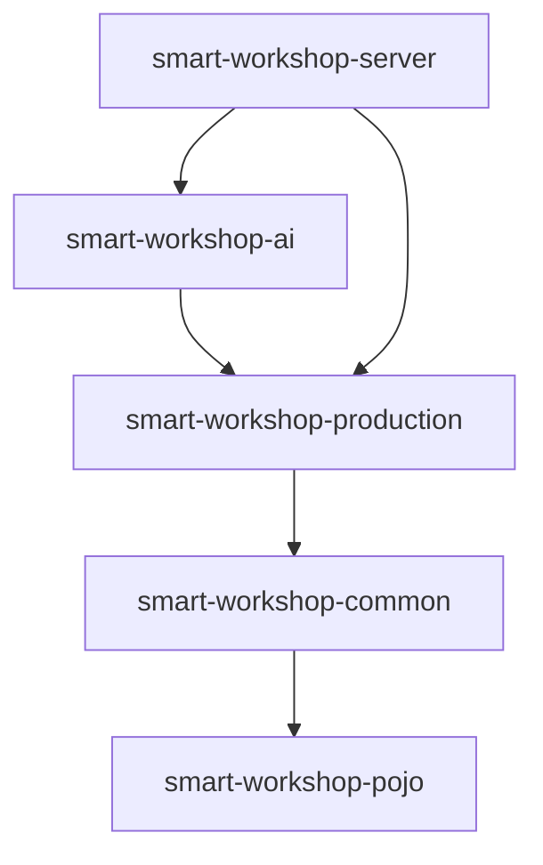

# 智联车间轻量化MES系统 — AI 智能交互模块详细设计

> **版本**: v1.0  
> **日期**: 2026-06-13  
> **文档类型**: 详细设计文档  
> **来源**: 基于需求规格说明书 v1.1 第 4.15 节「AI 智能交互与自然语言操作」  
> **依赖设计文档**: [01-系统架构详细设计](./01-系统架构详细设计.md)、[02-数据库详细设计](./02-数据库详细设计.md)、[05-RBAC权限系统详细设计](./05-RBAC权限系统详细设计.md)、[03-状态机系统详细设计](./03-状态机系统详细设计.md)

---

## 目录

1. [概述](#1-概述)
2. [模块定位与依赖](#2-模块定位与依赖)
3. [包结构与命名规范](#3-包结构与命名规范)
4. [核心组件设计](#4-核心组件设计)
5. [数据流：一次完整的 AI 消息交互](#5-数据流一次完整的-ai-消息交互)
6. [数据库表设计](#6-数据库表设计)
7. [接口设计](#7-接口设计)
8. [安全沙箱设计](#8-安全沙箱设计)
9. [LLM 提供商抽象](#9-llm-提供商抽象)
10. [工具注册与发现](#10-工具注册与发现)
11. [15 个初始工具定义](#11-15-个初始工具定义)
12. [配置设计](#12-配置设计)
13. [异常处理与降级](#13-异常处理与降级)
14. [指标与监控](#14-指标与监控)
15. [附录：扩展指南](#15-附录扩展指南)

---

## 1. 概述

### 1.1 设计背景

AI 智能交互模块是 MES 系统的**智能交互入口**，使终端用户能够在 AI 对话窗口中输入自然语言指令，由大语言模型（LLM）自动分析意图、选择并调用对应的 MES 业务工具，完成数据查询与写入操作。

本模块的设计基于需求规格说明书（SRS v1.1）第 4.15 节的 29 项功能需求（REQ-AI-001 ~ REQ-AI-029），以及 14 项非功能需求约束。

### 1.2 设计目标

| 目标 | 说明 |
|------|------|
| **降低操作门槛** | 用户无需记忆操作路径，通过自然语言即可完成复杂的车间数据操作 |
| **安全可控** | AI 操作复用现有四层安全防线（JWT→RBAC→状态机→门禁），破坏性操作二次确认 |
| **可追溯** | 所有 AI 触发的工具调用记录到 `ai_audit_log`，包含用户原始自然语言输入 |
| **可扩展** | 新增工具通过 `@AiTool` 注解即可注册，不修改 AI Agent 核心调度逻辑 |
| **提供商无关** | `AiProvider` 接口抽象 LLM 调用，配置即可切换 Claude/OpenAI/私有化模型 |

### 1.3 核心场景

| 场景 | 用户输入示例 | AI 执行流程 |
|------|-------------|------------|
| 设备功能添加 | "把'全自动超声波清洗'添加到设备'清洗机-CL01'的功能里" | search_equipment → add_equipment_function |
| 生产状态查询 | "查询产线 L-03 上所有正在运行的订单" | search_line → query_order_status |
| BOM 创建 | "创建一张物料名称为'铝合金外壳'的 BOM，图号为 DWG-2024-001" | create_bom |
| 状态变更 | "将计划 PLN-20240612-001 状态改为发布" | query_plan_status → publish_plan（需权限+门禁+确认） |

### 1.4 核心术语

| 术语 | 说明 |
|------|------|
| AI Agent | 智能调度器，负责接收用户消息、组装上下文、调用 LLM、执行工具、返回结果 |
| Function Calling (Tool Use) | LLM 根据用户意图选择并触发预定义的 MES 业务工具 |
| Tool Definition | 以 JSON Schema 格式描述的工具定义，包含名称、描述、参数、类型约束 |
| Tool Executor | 工具执行沙箱，负责参数校验、权限检查、确认检查、限流、调用 Service、写审计 |
| SSE | Server-Sent Events，单向流式推送协议，用于将 LLM 的逐 token 输出实时推送至前端 |
| TTFT | Time To First Token，从发送请求到收到第一个 token 的延迟 |

---

## 2. 模块定位与依赖

### 2.1 新增 Maven 模块

AI 智能交互模块创建为独立的 Maven 子模块 `smart-workshop-ai`，位于现有 4 模块的基础之上：

```
smart-workshop-parent/
├── smart-workshop-pojo/          # 领域对象层（不依赖任何模块）
├── smart-workshop-common/        # 基础设施层（依赖 pojo）
├── smart-workshop-production/    # 领域层（依赖 common）
├── smart-workshop-ai/            # ★ AI 智能交互层（依赖 production）
└── smart-workshop-server/        # 应用服务层（依赖 ai、production）
```

### 2.2 依赖关系



**依赖原则**：

- `smart-workshop-ai` 依赖 `production`：需要访问状态机（`StateMachine`）、权限策略接口（`PermissionPolicy`）、门禁策略接口（`GatePolicyInterface`）
- `smart-workshop-ai` 通过 `common` 间接依赖 `JwtUtils`（从 SecurityContext 获取当前用户）
- `smart-workshop-ai` 不依赖 `server`：与 Web 层的 Filter/Interceptor 解耦，通过 `AuthService` 接口做权限校验
- `smart-workshop-server` 新增对 `smart-workshop-ai` 的依赖，但 AI 的具体业务逻辑全部在 ai 模块内

### 2.3 与现有模块的交互边界

```
┌────────────────────────────────────────────────────────────┐
│  smart-workshop-server                                     │
│  ┌──────────────────┐    ┌──────────────────────────────┐  │
│  │  LoginFilter      │    │  WebConfig                    │  │
│  │  (JWT 认证)       │    │  (注册 AI 拦截器路径)          │  │
│  └──────────────────┘    └──────────────────────────────┘  │
└────────────────────────────────────────────────────────────┘
          │                          │
          ▼                          ▼
┌────────────────────────────────────────────────────────────┐
│  smart-workshop-ai                                         │
│  ┌────────────────┐  ┌──────────────┐  ┌───────────────┐  │
│  │ AiChatController│  │AiAgentService│  │  ToolExecutor │  │
│  │ (SSE 端点)      │→│ (编排调度)    │→│  (安全沙箱)    │  │
│  └────────────────┘  └──────┬───────┘  └───────┬───────┘  │
│                             │                  │           │
│                    ┌────────▼───────┐  ┌───────▼───────┐  │
│                    │  AiProvider     │  │  ToolRegistry │  │
│                    │  (LLM 抽象)     │  │  (注解扫描)    │  │
│                    └────────────────┘  └───────────────┘  │
└────────────────────────────────┬───────────────────────────┘
                                 │ 调用现有 Service
                                 ▼
┌────────────────────────────────────────────────────────────┐
│  smart-workshop-server (Service 层)                        │
│  ┌──────────────────┐  ┌──────────────┐  ┌─────────────┐  │
│  │equipmentServiceImpl│ │planStateServiceImpl│AuthService│  │
│  └──────────────────┘  └──────────────┘  └─────────────┘  │
└────────────────────────────────────────────────────────────┘
```

**关键约束**：AI 模块**不直接访问 Mapper 层**，所有数据操作通过调用现有 Service 层接口完成。

---

## 3. 包结构与命名规范

### 3.1 包路径

所有 AI 模块代码位于 `com.xtax.ai` 包下（新建模块 `smart-workshop-ai`）：

```
com.xtax.ai/
├── annotation/             # AI 注解定义
│   ├── AiTool.java         # @AiTool 工具标记注解
│   └── ToolParam.java      # @ToolParam 参数描述注解
│
├── config/                 # AI 配置
│   └── AiProperties.java   # @ConfigurationProperties("ai")
│
├── controller/             # AI 控制器（3个）
│   ├── AiChatController.java       # 会话管理 + SSE 消息发送
│   ├── AiAuditController.java      # 审计日志查询
│   └── AiMetricsController.java    # 指标查询
│
├── entity/                 # AI 实体类（3个）
│   ├── AiChatSession.java          # 会话实体
│   ├── AiChatMessage.java          # 消息实体
│   └── AiAuditLog.java             # 审计日志实体
│
├── dto/                    # AI DTO
│   ├── SendMessageRequest.java     # 发送消息请求体
│   ├── SessionCreateRequest.java   # 创建会话请求体
│   └── AiAuditQueryParam.java      # 审计查询参数
│
├── enums/                  # AI 枚举
│   ├── SessionStatus.java          # ACTIVE / ARCHIVED
│   ├── MessageRole.java            # user / assistant / system / tool
│   └── SseEventType.java           # thinking / text_delta / tool_call / tool_result / done / error
│
├── mapper/                 # MyBatis Mapper 接口（3个）
│   ├── AiChatSessionMapper.java
│   ├── AiChatMessageMapper.java
│   └── AiAuditLogMapper.java
│
├── service/                # AI 服务层
│   ├── AiSessionService.java      # 接口
│   ├── AiAuditService.java        # 接口
│   ├── AiMetricsService.java      # 接口
│   └── impl/
│       ├── AiSessionServiceImpl.java
│       ├── AiAuditServiceImpl.java
│       └── AiMetricsServiceImpl.java
│
├── agent/                  # AI Agent 核心
│   ├── AiProvider.java            # LLM 提供商接口
│   ├── ChatRequest.java           # 聊天请求值对象
│   ├── AiEvent.java               # SSE 事件值对象
│   ├── AiAgentService.java        # Agent 编排接口
│   ├── AiAgentServiceImpl.java    # Agent 编排实现
│   ├── ToolRegistry.java          # 工具注册表（注解扫描）
│   ├── AiToolMeta.java            # 工具元信息值对象
│   ├── ToolExecutor.java          # 工具执行沙箱
│   ├── ToolHandler.java           # 工具处理器接口
│   ├── ToolContext.java           # 工具执行上下文
│   ├── ToolResult.java            # 工具执行结果
│   └── provider/
│       ├── ClaudeProvider.java    # Claude API 实现
│       └── OpenAiProvider.java    # OpenAI API 实现
│
└── tool/                   # ★ 工具实现（按领域分包）
    ├── equipment/
    │   ├── SearchEquipmentTool.java
    │   ├── GetEquipmentDetailTool.java
    │   ├── AddEquipmentFunctionTool.java
    │   ├── UpdateEquipmentFunctionTool.java
    │   └── DeleteEquipmentFunctionTool.java
    ├── bom/
    │   ├── SearchBomTool.java
    │   └── CreateBomTool.java
    ├── process/
    │   └── SearchProcessTool.java
    ├── workstep/
    │   ├── SearchWorkStepTool.java
    │   └── AddWorkStepTool.java
    ├── line/
    │   └── SearchLineTool.java
    ├── production/
    │   ├── QueryPlanStatusTool.java
    │   ├── QueryOrderStatusTool.java
    │   └── QueryWorkOrderStatusTool.java
    └── team/
        └── SearchTeamTool.java
```

### 3.2 资源文件

```
smart-workshop-ai/src/main/resources/
├── application-ai.yml                          # AI 默认配置
└── com/xtax/ai/mapper/
    ├── AiChatSessionMapper.xml                 # MyBatis XML 映射
    ├── AiChatMessageMapper.xml
    └── AiAuditLogMapper.xml
```

---

## 4. 核心组件设计

### 4.1 组件总览

```
┌─────────────────────────────────────────────────────────────────┐
│                     AI Agent 核心组件                            │
│                                                                 │
│  ┌──────────────────────┐      ┌──────────────────────────┐    │
│  │    AiAgentService     │      │      ToolRegistry         │    │
│  │    (编排调度器)        │      │      (工具注册表)          │    │
│  │                      │      │                          │    │
│  │ process(sessionId,   │      │ scan(@AiTool beans)      │    │
│  │   message, emitter)  │      │ getDefinitions()→JSON    │    │
│  └──────────┬───────────┘      │ getHandler(name)→Tool    │    │
│             │                  └────────────┬─────────────┘    │
│             │                               │ 扫描              │
│             ▼                               ▼                   │
│  ┌──────────────────────┐      ┌──────────────────────────┐    │
│  │     AiProvider        │      │     ToolExecutor          │    │
│  │     (LLM 抽象)        │      │     (执行沙箱)             │    │
│  │                      │      │                          │    │
│  │ streamChat(request)   │      │ execute(name, params,    │    │
│  │  → Flux<AiEvent>     │      │   ctx) → ToolResult      │    │
│  └──────────────────────┘      └──────────────────────────┘    │
│          实现                            使用                   │
│  ┌──────────┬──────────┐            ┌──────────────┐           │
│  │ Claude   │ OpenAI   │            │  @AiTool     │           │
│  │ Provider │ Provider │            │  components  │           │
│  └──────────┴──────────┘            │  (15 tools)  │           │
│                                      └──────────────┘           │
└─────────────────────────────────────────────────────────────────┘
```

### 4.2 AiAgentService — 核心编排器

**职责**：一次 AI 对话的完整生命周期管理。这是整个 AI 模块的"大脑"。

**接口定义**：

```java
package com.xtax.ai.agent;

/**
 * AI Agent 调度器 —— 负责一次 AI 消息交互的完整编排：
 * 组装上下文 → 调用 LLM → 解析工具调用 → 执行 → 返回结果 → 写入审计
 * 
 * @author AI Module Design
 * @since 2026-06-13
 */
public interface AiAgentService {

    /**
     * 处理用户消息，通过 SseEmitter 流式推送响应
     * 
     * @param sessionId  会话 ID
     * @param message    用户消息（含 content）
     * @param emitter    SSE 发射器，用于向前端推送流式事件
     */
    void process(Long sessionId, SendMessageRequest message, SseEmitter emitter);
}
```

**实现流程（AiAgentServiceImpl）**：

```
process(sessionId, message, emitter)

  Phase 1: 准备 ──────────────────────────────────────
  │ 1. 保存用户消息 (role=user) 到 ai_chat_message
  │ 2. 更新会话 updated_at
  │ 3. 若为首条消息 → 自动生成标题（前 50 字符）
  │
  Phase 2: 组装上下文 ──────────────────────────────────
  │ 4. 加载 System Prompt（SystemMessageBuilder）
  │ 5. 从 DB 加载最近 N 轮历史消息（默认 20 轮）
  │ 6. 注入当前用户信息（userId, userName, roleCodes）
  │ 7. 从 ToolRegistry 获取 tools JSON Schema
  │
  Phase 3: LLM 推理循环（最多 5 轮工具调用）─────────────
  │ while (round < 5):
  │   8. emitter.send(THINKING)
  │   9. AiProvider.streamChat(request)
  │      → 逐 token 推送 text_delta
  │      → 收集完整响应文本
  │  10. 判断 LLM 响应类型:
  │      ├── text (无工具调用): 跳出循环
  │      └── tool_use:
  │          a. emitter.send(TOOL_CALL, {name, params})
  │          b. result = ToolExecutor.execute(name, params, ctx)
  │          c. emitter.send(TOOL_RESULT, result)
  │          d. 将 tool_result 追加到上下文
  │          e. round++, 继续循环
  │
  Phase 4: 收尾 ──────────────────────────────────────
  │ 11. 保存 assistant 消息 (role=assistant)
  │ 12. emitter.send(DONE, {messageId, tokenUsage})
  │ 13. emitter.complete()
  │
  Phase 5: 异常处理 ──────────────────────────────────
  │ 14. 任何异常 → emitter.send(ERROR, {code, message})
  │ 15. emitter.completeWithError() 或 complete()
```

**关键代码片段**：

```java
@Slf4j
@Service
public class AiAgentServiceImpl implements AiAgentService {

    private final AiChatMessageMapper messageMapper;
    private final AiChatSessionMapper sessionMapper;
    private final AiProvider aiProvider;          // 由配置决定注入哪个实现
    private final ToolRegistry toolRegistry;
    private final ToolExecutor toolExecutor;
    private final AiProperties aiProperties;

    // 构造器注入（省略）

    @Override
    public void process(Long sessionId, SendMessageRequest request, SseEmitter emitter) {
        try {
            // Phase 1: 保存用户消息
            AiChatMessage userMsg = saveUserMessage(sessionId, request.getContent());
            autoGenerateTitleIfNeeded(sessionId, request.getContent());

            // Phase 2: 组装上下文
            List<Map<String, Object>> messages = buildContextMessages(sessionId);
            injectUserProfile(messages);       // 注入 userId/角色
            List<Map<String, Object>> tools = toolRegistry.getToolDefinitions();

            // Phase 3: LLM 推理循环（最多 5 轮工具调用）
            String fullResponse = "";
            Map<String, Object> tokenUsage = null;
            List<Map<String, Object>> toolCalls = new ArrayList<>();

            for (int round = 0; round < 5; round++) {
                emitter.send(SseEventType.THINKING.toEvent());
                
                ChatRequest chatReq = ChatRequest.builder()
                    .messages(messages)
                    .tools(tools)
                    .maxTokens(aiProperties.getLlm().getMaxTokens())
                    .temperature(aiProperties.getLlm().getTemperature())
                    .build();

                // 流式调用 LLM
                Flux<AiEvent> eventFlux = aiProvider.streamChat(chatReq);
                List<AiEvent> events = new ArrayList<>();
                
                // 收集流事件（实际需处理背压）
                eventFlux.doOnNext(event -> {
                    if (event.getType() == AiEvent.EventType.TEXT_DELTA) {
                        emitter.send(SseEventType.TEXT_DELTA.toEvent(event.getData()));
                        fullResponse += event.getData();
                    }
                }).collectList().block();  // 同步等待（在异步线程内 OK）

                AiEvent decision = parseFinalDecision(events);
                
                if (decision.getType() == AiEvent.EventType.TEXT_COMPLETE) {
                    // LLM 返回纯文本，无工具调用
                    tokenUsage = decision.getTokenUsage();
                    break;
                } else if (decision.getType() == AiEvent.EventType.TOOL_USE) {
                    // LLM 请求调用工具
                    for (AiEvent.ToolUse toolUse : decision.getToolUses()) {
                        emitter.send(SseEventType.TOOL_CALL.toEvent(toolUse));
                        
                        ToolContext ctx = ToolContext.builder()
                            .userId(getCurrentUserId())
                            .userName(getCurrentUserName())
                            .sessionId(sessionId)
                            .messageId(userMsg.getId())
                            .build();
                        
                        ToolResult result = toolExecutor.execute(
                            toolUse.getName(), toolUse.getParams(), ctx);
                        
                        emitter.send(SseEventType.TOOL_RESULT.toEvent(result));
                        
                        // 将工具结果追加到消息上下文
                        messages.add(Map.of("role", "tool",
                            "tool_call_id", toolUse.getId(),
                            "content", objectMapper.writeValueAsString(result)));
                        
                        toolCalls.add(Map.of(
                            "name", toolUse.getName(),
                            "params", toolUse.getParams(),
                            "result", Map.of("success", result.isSuccess())
                        ));
                    }
                }
            }

            // Phase 4: 保存 AI 回复并收尾
            AiChatMessage assistantMsg = saveAssistantMessage(
                sessionId, fullResponse, toolCalls, tokenUsage);
            
            emitter.send(SseEventType.DONE.toEvent(Map.of(
                "messageId", assistantMsg.getId(),
                "tokenUsage", tokenUsage
            )));
            emitter.complete();

        } catch (AiRateLimitException e) {
            emitter.send(SseEventType.ERROR.toEvent(Map.of(
                "code", "RATE_LIMIT",
                "message", "操作过于频繁，请稍后重试"
            )));
            emitter.complete();
        } catch (Exception e) {
            log.error("AI Agent processing failed: sessionId={}", sessionId, e);
            emitter.send(SseEventType.ERROR.toEvent(Map.of(
                "code", "INTERNAL_ERROR",
                "message", "AI 处理出错，请重试"
            )));
            emitter.complete();
        }
    }
}
```

### 4.3 ToolExecutor — 工具执行沙箱

**职责**：在沙箱环境中安全地执行 LLM 请求的工具调用，复用现有的安全防线。

**执行流程（7 步沙箱管道）**：

```
execute(toolName, params, toolContext)

  Step 1 ── 工具查找
            │ toolRegistry.getHandler(toolName)
            │ toolRegistry.getMeta(toolName)
            │ 工具不存在 → 返回 ToolResult.error("不支持的操作")
            ▼
  Step 2 ── 参数校验
            │ 反射读取 @ToolParam 注解
            │ 必填检查: required=true 但参数缺失 → 返回追问信息
            │ 类型检查: 参数类型与 Schema 定义不符 → 返回校验错误
            │ 枚举检查: enumValues 约束的字段值不在允许范围内 → 返回错误
            ▼
  Step 3 ── 权限校验
            │ 从 toolMeta 获取 @AiTool.permissions
            │ 无权限要求 → 跳过
            │ 有权限要求 → AuthService.getUserPermissionCodes(userId)
            │            检查用户权限集合 ⊇ 工具所需权限集合
            │ 权限不足 → 返回 ToolResult.error("您没有[设备管理]权限")
            ▼
  Step 4 ── 确认检查（仅破坏性操作）
            │ toolMeta.requiresConfirmation == false → 跳过
            │ 检查 LLM 上下文：上轮消息中是否包含用户确认标记
            │ 未确认 → 返回 ToolResult.needsConfirmation("即将[删除设备功能]...")
            ▼
  Step 5 ── 限流检查
            │ 同一 sessionId 下：计数器.incAndGet()
            │ 超过 10 次/分钟 → 抛出 AiRateLimitException
            ▼
  Step 6 ── 执行业务操作（★关键：调用现有 Service★）
            │
            │ 查询类工具 → 直接调用对应 Service 方法
            │   例: equipmentService.getEquipmentByName(keyword)
            │
            │ 写入类工具 → 调用对应 Service 方法
            │   例: equipmentService.addFunctionToEquipment(eqId, desc)
            │
            │ 状态变更类工具 → ★调用现有 StateService.handle()★
            │   例: planStateService.handle(bizNo, ActionEnum.PUBLISH, userId)
            │     → 走完整的 8 步管道（权限+状态机+门禁+审计+级联）
            │
            │ 执行成功 → ToolResult.success(data)
            │ 执行失败 → 捕获异常，返回 ToolResult.error(自然语言描述)
            │     BusinessException → 将业务错误信息自然语言化
            │     SecurityException → "您没有权限执行此操作"
            │     IllegalStateException → "当前状态不允许此操作"
            ▼
  Step 7 ── 记录审计
            │ 写入 ai_audit_log:
            │   · session_id, message_id, user_id
            │   · tool_name, tool_params (JSON)
            │   · execution_result (TEXT)
            │   · target_type, target_id
            │   · success (boolean)
            │   · error_message (失败时)
            │   · duration_ms (执行耗时)
            │   · user_natural_input (用户原始自然语言)
```

**关键代码片段**：

```java
@Slf4j
@Component
public class ToolExecutor {

    private final ToolRegistry toolRegistry;
    private final AuthService authService;           // ★ RBAC 权限校验
    private final AiAuditLogMapper auditLogMapper;
    // 限流计数器（ConcurrentHashMap）
    private final ConcurrentHashMap<Long, RateLimiter> sessionRateLimiters = new ConcurrentHashMap<>();

    /**
     * 在沙箱中执行工具调用，复用现有的多道安全防线
     */
    public ToolResult execute(String toolName, Map<String, Object> params, ToolContext ctx) {
        long startTime = System.currentTimeMillis();
        AiAuditLog auditLog = new AiAuditLog();
        auditLog.setSessionId(ctx.getSessionId());
        auditLog.setMessageId(ctx.getMessageId());
        auditLog.setUserId(ctx.getUserId());
        auditLog.setToolName(toolName);
        auditLog.setToolParams(JSON.toJSONString(params));

        try {
            // Step 1: 工具查找
            ToolHandler handler = toolRegistry.getHandler(toolName);
            AiToolMeta meta = toolRegistry.getMeta(toolName);
            if (handler == null) {
                return fail(auditLog, startTime, "不支持的操作: " + toolName);
            }

            // Step 2: 参数校验
            ValidationResult validation = validateParams(meta, params);
            if (!validation.isValid()) {
                return fail(auditLog, startTime, validation.getErrorMessage());
            }
            // 脱敏后的参数存审计
            auditLog.setToolParams(JSON.toJSONString(params));

            // Step 3: RBAC 权限校验
            if (meta.getPermissions() != null && meta.getPermissions().length > 0) {
                Set<String> userPerms = authService.getUserPermissionCodes(ctx.getUserId());
                boolean hasAllPerms = Arrays.stream(meta.getPermissions())
                    .allMatch(userPerms::contains);
                if (!hasAllPerms) {
                    String permDesc = String.join("、", meta.getPermissions());
                    return fail(auditLog, startTime, "您没有[" + permDesc + "]相关权限");
                }
            }

            // Step 4: 确认检查（破坏性操作）
            if (meta.isRequiresConfirmation() && !ctx.isConfirmed()) {
                return ToolResult.needsConfirmation(
                    "即将执行【" + meta.getLabel() + "】操作：" + meta.getDescription()
                    + "。此操作可能产生不可逆的影响。请回复"确认"以继续。"
                );
            }

            // Step 5: 限流检查
            checkRateLimit(ctx.getSessionId());

            // Step 6: ★ 调用业务 Service 执行实际操作
            ToolResult result = handler.execute(params, ctx);

            // Step 7: 记录审计
            auditLog.setSuccess(result.isSuccess());
            auditLog.setExecutionResult(result.isSuccess() ?
                JSON.toJSONString(result.getData()) : result.getErrorMessage());
            auditLog.setDurationMs(System.currentTimeMillis() - startTime);
            auditLogMapper.insert(auditLog);

            return result;

        } catch (BusinessException e) {
            return fail(auditLog, startTime, e.getMessage());
        } catch (SecurityException e) {
            return fail(auditLog, startTime, "权限不足：" + e.getMessage());
        } catch (IllegalStateException e) {
            return fail(auditLog, startTime, "操作不允许：" + e.getMessage());
        } catch (Exception e) {
            log.error("Tool execution error: {}", toolName, e);
            return fail(auditLog, startTime, "系统错误，请稍后重试");
        }
    }
}
```

### 4.4 ToolRegistry — 注解扫描注册表

**职责**：启动时扫描所有 `@AiTool` 注解的 Bean，自动构建工具注册表和 JSON Schema。

```java
@Slf4j
@Component
public class ToolRegistry implements ApplicationContextAware {

    private ApplicationContext applicationContext;

    /** toolName → ToolHandler 映射 */
    private final Map<String, ToolHandler> handlers = new ConcurrentHashMap<>();
    /** toolName → AiToolMeta 映射 */
    private final Map<String, AiToolMeta> metas = new ConcurrentHashMap<>();
    /** 发送给 LLM 的 JSON Schema 定义列表（缓存） */
    private volatile List<Map<String, Object>> cachedDefinitions;

    /**
     * 启动时扫描所有 @AiTool Bean
     */
    @PostConstruct
    public void scan() {
        Map<String, Object> toolBeans = applicationContext.getBeansWithAnnotation(AiTool.class);

        for (Map.Entry<String, Object> entry : toolBeans.entrySet()) {
            Object bean = entry.getValue();
            Class<?> beanClass = AopProxyUtils.ultimateTargetClass(bean);  // 处理 AOP 代理
            AiTool annotation = beanClass.getAnnotation(AiTool.class);

            if (!(bean instanceof ToolHandler)) {
                log.warn("@AiTool 标注的类 {} 未实现 ToolHandler 接口，跳过", beanClass.getName());
                continue;
            }

            String toolName = annotation.name();
            ToolHandler handler = (ToolHandler) bean;

            // 反射提取 @ToolParam 字段构建 ToolParamMeta
            List<ToolParamMeta> paramMetas = extractParamMetas(beanClass);

            AiToolMeta meta = AiToolMeta.builder()
                .name(toolName)
                .label(annotation.name())           // 可用 description 首句
                .description(annotation.description())
                .category(annotation.category())
                .permissions(annotation.permissions())
                .requiresConfirmation(annotation.requiresConfirmation())
                .handlerClass(beanClass.getName())
                .params(paramMetas)
                .build();

            handlers.put(toolName, handler);
            metas.put(toolName, meta);
            log.info("注册 AI 工具: {} → {}", toolName, beanClass.getSimpleName());
        }

        // 构建 LLM 可用的 JSON Schema 列表
        buildDefinitions();
        log.info("AI 工具注册完成，共 {} 个工具", handlers.size());
    }

    /**
     * 构建发送给 LLM 的 JSON Schema 工具定义列表
     */
    private void buildDefinitions() {
        List<Map<String, Object>> defs = new ArrayList<>();
        for (AiToolMeta meta : metas.values()) {
            Map<String, Object> toolDef = new LinkedHashMap<>();
            toolDef.put("name", meta.getName());
            toolDef.put("description", meta.getDescription());

            Map<String, Object> inputSchema = new LinkedHashMap<>();
            inputSchema.put("type", "object");

            Map<String, Object> properties = new LinkedHashMap<>();
            List<String> required = new ArrayList<>();

            for (ToolParamMeta param : meta.getParams()) {
                Map<String, Object> prop = new LinkedHashMap<>();
                prop.put("type", param.getJsonType());
                prop.put("description", param.getDescription());
                if (param.getEnumValues() != null && param.getEnumValues().length > 0) {
                    prop.put("enum", Arrays.asList(param.getEnumValues()));
                }
                properties.put(param.getName(), prop);

                if (param.isRequired()) {
                    required.add(param.getName());
                }
            }

            inputSchema.put("properties", properties);
            if (!required.isEmpty()) {
                inputSchema.put("required", required);
            }
            toolDef.put("input_schema", inputSchema);

            defs.add(toolDef);
        }
        this.cachedDefinitions = defs;
    }

    /** 获取发送给 LLM 的工具定义列表 */
    public List<Map<String, Object>> getToolDefinitions() {
        return cachedDefinitions;
    }

    /** 获取工具处理器 */
    public ToolHandler getHandler(String toolName) {
        return handlers.get(toolName);
    }

    /** 获取工具元信息 */
    public AiToolMeta getMeta(String toolName) {
        return metas.get(toolName);
    }
}
```

### 4.5 @AiTool 与 @ToolParam 注解

```java
/**
 * AI 工具标记注解。
 * 标注在工具实现类上，系统启动时自动扫描并注册到 ToolRegistry。
 * 
 * 被标注的类必须是 Spring Bean（@Component）且实现 ToolHandler 接口。
 */
@Target(ElementType.TYPE)
@Retention(RetentionPolicy.RUNTIME)
@Component
public @interface AiTool {

    /** 工具唯一名称，对应 LLM Function Calling 的 function.name */
    String name();

    /** 工具描述，发送给 LLM 用于意图匹配。应清晰说明工具的功能和使用场景 */
    String description();

    /** 工具分类（设备管理 / BOM管理 / 工序管理 ...） */
    String category() default "";

    /** 执行此工具所需的权限编码列表。空数组表示无需特定权限 */
    String[] permissions() default {};

    /** 是否为破坏性操作，需要用户二次确认 */
    boolean requiresConfirmation() default false;

    /** 工具中文标签，用于审计日志和前端展示 */
    String label() default "";
}

/**
 * 工具参数描述注解。
 * 标注在工具实现类的字段上，用于自动生成 JSON Schema 参数定义。
 */
@Target(ElementType.FIELD)
@Retention(RetentionPolicy.RUNTIME)
public @interface ToolParam {

    /** 参数描述，发送给 LLM 帮助正确填充 */
    String description();

    /** 是否必填 */
    boolean required() default false;

    /** 枚举约束值列表，如 {"CREATED", "RELEASED", "RUNNING"} */
    String[] enumValues() default {};
}
```

---

## 5. 数据流：一次完整的 AI 消息交互

### 5.1 时序图

```
前端              AiChatController      AiAgentService       AiProvider(LLM)    ToolExecutor     业务Service
 │                      │                      │                    │                │                │
 │ POST /ai/chat/        │                      │                    │                │                │
 │ sessions/1/messages   │                      │                    │                │                │
 │─────────────────────▶│                      │                    │                │                │
 │                      │ 保存用户消息           │                    │                │                │
 │                      │─────────────────────▶│                    │                │                │
 │  201 (SSE流开始)      │ 异步：process()       │                    │                │                │
 │◀─────────────────────│                      │                    │                │                │
 │                      │                      │                    │                │                │
 │                      │                      │ 加载历史消息(20轮)   │                │                │
 │                      │                      │───────────────────│                │                │
 │                      │                      │ 注入用户信息        │                │                │
 │                      │                      │ 挂载ToolDefinitions│                │                │
 │                      │                      │                    │                │                │
 │                      │                      │ streamChat(req)    │                │                │
 │                      │                      │──────────────────▶│                │                │
 │                      │                      │                    │                │                │
 │ SSE: thinking        │◀─────────────────────│◀───────────────────│                │                │
 │◀─────────────────────│                      │                    │                │                │
 │                      │                      │                    │                │                │
 │ SSE: text_delta      │                      │ 流式token           │                │                │
 │ {"content":"正在"}    │◀─────────────────────│◀───────────────────│                │                │
 │◀─────────────────────│                      │                    │                │                │
 │                      │                      │                    │                │                │
 │ SSE: text_delta      │                      │ 流式token           │                │                │
 │ {"content":"查询"}    │◀─────────────────────│◀───────────────────│                │                │
 │◀─────────────────────│                      │                    │                │                │
 │                      │                      │                    │                │                │
 │                      │                      │ LLM决策: tool_use   │                │                │
 │                      │                      │ name=search_eqpt    │                │                │
 │                      │                      │◀───────────────────│                │                │
 │                      │                      │                    │                │                │
 │ SSE: tool_call       │                      │                    │                │                │
 │ {name, params}       │◀─────────────────────│                    │                │                │
 │◀─────────────────────│                      │                    │                │                │
 │                      │                      │ execute(name,      │                │                │
 │                      │                      │   params, ctx)     │                │                │
 │                      │                      │─────────────────────────────────▶│                │
 │                      │                      │                    │  Step1-5:     │                │
 │                      │                      │                    │  参数/权限/确认 │                │
 │                      │                      │                    │  /限流校验     │                │
 │                      │                      │                    │               │                │
 │                      │                      │                    │ Step6: 调用   │                │
 │                      │                      │                    │──────────────────────────────▶│
 │                      │                      │                    │◀──────────────────────────────│
 │                      │                      │                    │               │                │
 │                      │                      │                    │ Step7: 写审计 │                │
 │                      │                      │                    │──────────────│                │
 │                      │                      │◀───────────────────│               │                │
 │                      │                      │                    │               │                │
 │ SSE: tool_result     │                      │                    │               │                │
 │ {equipment found}    │◀─────────────────────│                    │               │                │
 │◀─────────────────────│                      │                    │               │                │
 │                      │                      │                    │               │                │
 │                      │                      │ 将tool_result回传LLM│               │                │
 │                      │                      │──────────────────▶│               │                │
 │                      │                      │                    │               │                │
 │                      │                      │ LLM再次tool_use:   │               │                │
 │                      │                      │ add_eqpt_function  │               │                │
 │                      │                      │◀───────────────────│               │                │
 │                      │                      │                    │               │                │
 │ SSE: tool_call       │                      │                    │               │                │
 │ {add_function}       │◀─────────────────────│                    │               │                │
 │◀─────────────────────│                      │                    │               │                │
 │                      │                      │ execute(...)       │               │                │
 │                      │                      │─────────────────────────────────▶│  → Service    │
 │                      │                      │◀─────────────────────────────────│               │
 │                      │                      │                    │               │                │
 │ SSE: tool_result     │◀─────────────────────│                    │               │                │
 │◀─────────────────────│                      │                    │               │                │
 │                      │                      │                    │               │                │
 │                      │                      │ 最终LLM回复文本      │               │                │
 │                      │                      │◀───────────────────│               │                │
 │                      │                      │                    │               │                │
 │ SSE: text_delta      │                      │                    │               │                │
 │ "已成功将..."         │◀─────────────────────│                    │               │                │
 │◀─────────────────────│                      │                    │               │                │
 │                      │                      │                    │               │                │
 │ SSE: done            │                      │ 保存assistant消息    │               │                │
 │ {messageId,token}    │◀─────────────────────│                    │               │                │
 │◀─────────────────────│                      │                    │               │                │
 │                      │                      │                    │               │                │
```

### 5.2 消息上下文组装规则

每次调用 LLM 时，上下文消息数组按以下顺序组装：

```java
/**
 * 构建发送给 LLM 的完整消息数组
 */
private List<Map<String, Object>> buildContextMessages(Long sessionId) {
    List<Map<String, Object>> messages = new ArrayList<>();

    // 1. System Prompt（始终第一条）
    messages.add(Map.of("role", "system", "content", buildSystemPrompt()));

    // 2. 历史消息（最近 N 轮，默认 20 轮）
    List<AiChatMessage> history = messageMapper.selectRecentBySessionId(
        sessionId, aiProperties.getSession().getMaxHistoryRounds());
    for (AiChatMessage msg : history) {
        messages.add(Map.of("role", msg.getRole(), "content", msg.getContent()));
    }

    return messages;
}

/**
 * 构建 System Prompt
 */
private String buildSystemPrompt() {
    return """
        你是智能车间 MES 系统的 AI 助手。你可以：
        1. 回答用户关于生产管理、设备、BOM、工艺流程等方面的问题
        2. 根据用户指令，调用系统工具完成数据查询和操作
        3. 在执行写入操作前，清楚地说明即将执行的操作并获得确认

        重要约束：
        - 始终以中文回复
        - 对于删除、终止等破坏性操作，必须获得用户明确确认后再执行
        - 当用户请求模糊时，主动追问澄清
        - 工具调用结果中的技术错误信息，应转化为用户友好的自然语言
        - 当前用户信息已注入上下文，根据用户角色调整回复风格
        """;
}
```

---

## 6. 数据库表设计

### 6.1 ai_chat_session — AI 对话会话

| 字段名 | 类型 | 约束 | 说明 |
|--------|------|------|------|
| `id` | BIGINT | PK, AUTO_INCREMENT | 主键 |
| `user_id` | INT | NOT NULL, FK→users.id | 会话归属用户 |
| `title` | VARCHAR(100) | DEFAULT '' | 会话标题（首条消息前 50 字符自动生成） |
| `status` | VARCHAR(20) | NOT NULL, DEFAULT 'ACTIVE' | ACTIVE / ARCHIVED |
| `created_at` | DATETIME | NOT NULL, DEFAULT CURRENT_TIMESTAMP | 创建时间 |
| `updated_at` | DATETIME | NOT NULL, DEFAULT CURRENT_TIMESTAMP ON UPDATE | 最后活跃时间 |

**索引**：
- `idx_user_id` ON (`user_id`)
- `idx_updated_at` ON (`updated_at` DESC) — 按活跃时间排序查询

**清理策略**：定时任务（Spring `@Scheduled`）删除 `updated_at < NOW() - INTERVAL 90 DAY` 的会话（级联删除消息）。

### 6.2 ai_chat_message — 对话消息

| 字段名 | 类型 | 约束 | 说明 |
|--------|------|------|------|
| `id` | BIGINT | PK, AUTO_INCREMENT | 主键 |
| `session_id` | BIGINT | NOT NULL, FK→ai_chat_session.id ON DELETE CASCADE | 所属会话 |
| `role` | VARCHAR(20) | NOT NULL | user / assistant / system / tool |
| `content` | TEXT | NOT NULL | 消息内容（Markdown 格式，tool 角色时为 JSON） |
| `tool_calls` | JSON | NULL | AI 请求的工具调用列表 [{name, params, result}] |
| `token_usage` | JSON | NULL | token 消耗 {prompt, completion, total} |
| `created_at` | DATETIME | NOT NULL, DEFAULT CURRENT_TIMESTAMP | 创建时间 |

**索引**：
- `idx_session_id` ON (`session_id`, `created_at`) — 加载历史消息

### 6.3 ai_audit_log — AI 操作审计日志

| 字段名 | 类型 | 约束 | 说明 |
|--------|------|------|------|
| `id` | BIGINT | PK, AUTO_INCREMENT | 主键 |
| `session_id` | BIGINT | NOT NULL | 关联会话 |
| `message_id` | BIGINT | NOT NULL | 关联用户消息 |
| `user_id` | INT | NOT NULL | 操作人（JWT 中的 userId） |
| `tool_name` | VARCHAR(100) | NOT NULL | 调用的工具名称 |
| `tool_params` | JSON | NULL | 工具参数（脱敏后） |
| `execution_result` | TEXT | NULL | 执行结果（成功时为返回值 JSON，失败时为错误信息） |
| `target_type` | VARCHAR(50) | NULL | 操作目标类型（表名或实体名） |
| `target_id` | VARCHAR(100) | NULL | 操作目标 ID |
| `success` | TINYINT(1) | NOT NULL | 是否成功 |
| `error_message` | VARCHAR(500) | NULL | 失败时的错误信息 |
| `duration_ms` | INT | NULL | 执行耗时（毫秒） |
| `user_natural_input` | TEXT | NULL | 用户原始自然语言输入 |
| `created_at` | DATETIME | NOT NULL, DEFAULT CURRENT_TIMESTAMP | 审计时间 |

**索引**：
- `idx_user_id` ON (`user_id`, `created_at`) — 按用户查询
- `idx_session_id` ON (`session_id`) — 按会话查询
- `idx_created_at` ON (`created_at`) — 按时间范围查询
- `idx_tool_name` ON (`tool_name`) — 按工具统计

### 6.4 ai_tool_registry — 工具注册表（管理用）

> 本表为可选的元数据管理表，用于前端工具管理面板展示和启用/禁用控制。核心工具发现通过 `@AiTool` 注解完成，此表提供运行时覆盖能力。

| 字段名 | 类型 | 约束 | 说明 |
|--------|------|------|------|
| `id` | BIGINT | PK, AUTO_INCREMENT | 主键 |
| `tool_name` | VARCHAR(100) | NOT NULL, UNIQUE | 工具名称 |
| `tool_label` | VARCHAR(100) | NULL | 工具中文标签 |
| `category` | VARCHAR(50) | NULL | 工具分类 |
| `permissions` | JSON | NULL | 所需权限编码列表 |
| `schema_definition` | JSON | NULL | JSON Schema 完整定义 |
| `requires_confirmation` | TINYINT(1) | DEFAULT 0 | 是否需要二次确认 |
| `enabled` | TINYINT(1) | DEFAULT 1 | 是否启用（禁用的工具不注册到 LLM） |
| `created_at` | DATETIME | NOT NULL, DEFAULT CURRENT_TIMESTAMP | 创建时间 |

### 6.5 建表 DDL

```sql
-- AI 对话会话表
CREATE TABLE ai_chat_session (
    id BIGINT AUTO_INCREMENT PRIMARY KEY,
    user_id INT NOT NULL,
    title VARCHAR(100) DEFAULT '' COMMENT '会话标题',
    status VARCHAR(20) NOT NULL DEFAULT 'ACTIVE' COMMENT 'ACTIVE/ARCHIVED',
    created_at DATETIME NOT NULL DEFAULT CURRENT_TIMESTAMP,
    updated_at DATETIME NOT NULL DEFAULT CURRENT_TIMESTAMP ON UPDATE CURRENT_TIMESTAMP,
    INDEX idx_user_id (user_id),
    INDEX idx_updated_at (updated_at DESC),
    CONSTRAINT fk_ai_session_user FOREIGN KEY (user_id) REFERENCES users(id)
) ENGINE=InnoDB DEFAULT CHARSET=utf8mb4 COMMENT='AI 对话会话';

-- 对话消息表
CREATE TABLE ai_chat_message (
    id BIGINT AUTO_INCREMENT PRIMARY KEY,
    session_id BIGINT NOT NULL,
    role VARCHAR(20) NOT NULL COMMENT 'user/assistant/system/tool',
    content TEXT NOT NULL COMMENT '消息内容（Markdown/JSON）',
    tool_calls JSON NULL COMMENT 'AI 请求的工具调用列表',
    token_usage JSON NULL COMMENT 'token 消耗 {prompt, completion, total}',
    created_at DATETIME NOT NULL DEFAULT CURRENT_TIMESTAMP,
    INDEX idx_session_id (session_id, created_at),
    CONSTRAINT fk_ai_msg_session FOREIGN KEY (session_id) 
        REFERENCES ai_chat_session(id) ON DELETE CASCADE
) ENGINE=InnoDB DEFAULT CHARSET=utf8mb4 COMMENT='AI 对话消息';

-- AI 操作审计日志表
CREATE TABLE ai_audit_log (
    id BIGINT AUTO_INCREMENT PRIMARY KEY,
    session_id BIGINT NOT NULL,
    message_id BIGINT NOT NULL,
    user_id INT NOT NULL,
    tool_name VARCHAR(100) NOT NULL COMMENT '调用的工具名称',
    tool_params JSON NULL COMMENT '工具参数（脱敏后）',
    execution_result TEXT NULL COMMENT '执行结果',
    target_type VARCHAR(50) NULL COMMENT '操作目标类型',
    target_id VARCHAR(100) NULL COMMENT '操作目标 ID',
    success TINYINT(1) NOT NULL COMMENT '是否成功',
    error_message VARCHAR(500) NULL COMMENT '失败错误信息',
    duration_ms INT NULL COMMENT '执行耗时（毫秒）',
    user_natural_input TEXT NULL COMMENT '用户原始自然语言输入',
    created_at DATETIME NOT NULL DEFAULT CURRENT_TIMESTAMP,
    INDEX idx_user_id (user_id, created_at),
    INDEX idx_session_id (session_id),
    INDEX idx_created_at (created_at),
    INDEX idx_tool_name (tool_name)
) ENGINE=InnoDB DEFAULT CHARSET=utf8mb4 COMMENT='AI 操作审计日志';

-- 工具注册表（管理用，可选）
CREATE TABLE ai_tool_registry (
    id BIGINT AUTO_INCREMENT PRIMARY KEY,
    tool_name VARCHAR(100) NOT NULL UNIQUE COMMENT '工具名称',
    tool_label VARCHAR(100) NULL COMMENT '工具中文标签',
    category VARCHAR(50) NULL COMMENT '工具分类',
    permissions JSON NULL COMMENT '所需权限编码列表',
    schema_definition JSON NULL COMMENT 'JSON Schema 定义',
    requires_confirmation TINYINT(1) DEFAULT 0 COMMENT '是否需要二次确认',
    enabled TINYINT(1) DEFAULT 1 COMMENT '是否启用',
    created_at DATETIME NOT NULL DEFAULT CURRENT_TIMESTAMP
) ENGINE=InnoDB DEFAULT CHARSET=utf8mb4 COMMENT='AI 工具注册表';
```

---

## 7. 接口设计

### 7.1 接口总览

| 控制器 | 方法 | 路径 | 说明 |
|--------|------|------|------|
| AiChatController | POST | `/ai/chat/sessions` | 创建会话 |
| AiChatController | GET | `/ai/chat/sessions` | 会话列表（分页） |
| AiChatController | GET | `/ai/chat/sessions/{id}` | 会话详情+消息历史 |
| AiChatController | DELETE | `/ai/chat/sessions/{id}` | 删除会话 |
| AiChatController | POST | `/ai/chat/sessions/{id}/messages` | 发送消息（SSE） |
| AiAuditController | GET | `/ai/audit` | 审计日志查询 |
| AiMetricsController | GET | `/ai/metrics` | AI 指标查询 |

### 7.2 接口详细定义

#### 7.2.1 创建会话

```
POST /ai/chat/sessions
```

**请求头**：`Authorization: Bearer <JWT>`

**请求体**（可选）：
```json
{
  "title": "设备功能管理"     // 可选，不传则首条消息自动生成
}
```

**响应**：
```json
{
  "code": 1,
  "message": "操作成功",
  "data": {
    "id": 1,
    "userId": 5,
    "title": "",
    "status": "ACTIVE",
    "createdAt": "2026-06-13T10:30:00",
    "updatedAt": "2026-06-13T10:30:00"
  }
}
```

#### 7.2.2 查询会话列表

```
GET /ai/chat/sessions?page=1&pageSize=10
```

**响应**：
```json
{
  "total": 25,
  "rows": [
    {
      "id": 1,
      "title": "添加设备功能到清洗机",
      "status": "ACTIVE",
      "updatedAt": "2026-06-13T10:35:00"
    }
  ]
}
```

**说明**：按 `updated_at` 倒序排列，仅返回当前用户的会话。

#### 7.2.3 查询会话详情

```
GET /ai/chat/sessions/{sessionId}
```

**响应**：会话基本信息 + 全部消息历史（按时间正序）。

**权限**：仅允许查询自己的会话。

#### 7.2.4 删除会话

```
DELETE /ai/chat/sessions/{sessionId}
```

**说明**：级联删除所有关联消息（数据库 ON DELETE CASCADE）。

**权限**：仅允许删除自己的会话。

#### 7.2.5 发送消息（SSE 流式）★ 核心接口

```
POST /ai/chat/sessions/{sessionId}/messages
Content-Type: application/json
Accept: text/event-stream
```

**请求体**：
```json
{
  "content": "把'全自动超声波清洗'添加到设备'清洗机-CL01'的功能里"
}
```

**校验**：
- `content` 必填，最大长度 4000 字符
- 超过限制返回 400：`{"code": 0, "message": "消息内容超过 4000 字符限制"}`

**响应**：`Content-Type: text/event-stream`

```
event: thinking
data: {}

event: text_delta
data: {"content": "正在"}

event: text_delta
data: {"content": "帮您"}

event: text_delta
data: {"content": "查询"}

event: text_delta
data: {"content": "设备"}

...

event: tool_call
data: {"name": "search_equipment", "params": {"name": "清洗机-CL01"}}

event: tool_result
data: {"tool": "search_equipment", "result": {"id": 5, "name": "清洗机-CL01", "type": "清洗设备"}}

event: text_delta
data: {"content": "已"}

event: text_delta
data: {"content": "找到"}

...

event: tool_call
data: {"name": "add_equipment_function", "params": {"equipmentId": 5, "functionDescription": "全自动超声波清洗"}}

event: tool_result
data: {"tool": "add_equipment_function", "result": {"id": 12, "success": true}}

event: text_delta
data: {"content": "已成功将'全自动超声波清洗'功能添加到设备'清洗机-CL01'！"}

event: done
data: {"messageId": 42, "tokenUsage": {"prompt": 1200, "completion": 450, "total": 1650}}
```

**错误事件示例**：

```
event: error
data: {"code": "RATE_LIMIT", "message": "操作过于频繁，请稍后重试"}

event: error
data: {"code": "PERMISSION_DENIED", "message": "您没有设备管理权限，无法执行此操作"}

event: error
data: {"code": "LLM_TIMEOUT", "message": "AI 服务响应超时，请重试"}
```

#### 7.2.6 审计日志查询

```
GET /ai/audit?userId=5&toolName=add_equipment_function&startTime=2026-06-01&endTime=2026-06-13&page=1&pageSize=10
```

**响应**：分页的 `ai_audit_log` 记录列表。

#### 7.2.7 AI 指标查询

```
GET /ai/metrics
```

**响应**：
```json
{
  "code": 1,
  "data": {
    "totalRequests": 1523,
    "successRate": 0.973,
    "avgLatencyMs": 2340,
    "avgTtftMs": 1200,
    "totalTokensConsumed": 456000,
    "toolCallsByDay": [
      {"date": "2026-06-12", "count": 89},
      {"date": "2026-06-13", "count": 134}
    ],
    "errorBreakdown": {
      "RATE_LIMIT": 12,
      "PERMISSION_DENIED": 8,
      "LLM_TIMEOUT": 5
    }
  }
}
```

### 7.3 认证与权限

AI 接口（`/ai/**`）**不**被 `LoginFilter` 放行，所有请求必须携带有效 JWT。

在 `LoginFilter` 中确保 `/ai/**` 不在放行列表中：
```java
// LoginFilter.java 中的放行逻辑（保持不变，不含 /ai/**）
if ("/login".equals(requestURI)) {
    chain.doFilter(request, response);
    return;
}
// /ai/** 的请求会进入 JWT 验证流程
```

---

## 8. 安全沙箱设计

### 8.1 安全防线总览

AI 操作复用现有系统的四层安全防线，并在 ToolExecutor 中增加额外的沙箱检查：

```
┌──────────────────────────────────────────────────────────────┐
│  请求级防线（LoginFilter 保证）                                │
│  ┌────────────────────────────────────────────────────────┐  │
│  │  [0] JWT 认证 —— 验证 token 有效性，提取 userId         │  │
│  │      失败 → 401                                         │  │
│  └────────────────────────────────────────────────────────┘  │
├──────────────────────────────────────────────────────────────┤
│  工具执行前防线（ToolExecutor 保证）                           │
│  ┌────────────────────────────────────────────────────────┐  │
│  │  [1] RBAC 权限校验 —— AuthService.getUserPermissionCodes │  │
│  │      失败 → ToolResult.error("您没有[设备管理]权限")       │  │
│  │                                                         │  │
│  │  [2] 状态机校验 —— 若涉及状态变更                        │  │
│  │      ★ 此检查在调用 StateService.handle() 时自动触发     │  │
│  │      失败 → ToolResult.error("当前状态不允许此操作")      │  │
│  │                                                         │  │
│  │  [3] 门禁校验 —— 若涉及 PUBLISH 动作                     │  │
│  │      ★ 此检查在调用 StateService.handle() 时自动触发     │  │
│  │      失败 → ToolResult.error("产线产能不足/工艺不完整")   │  │
│  │                                                         │  │
│  │  [4] 确认检查 —— 破坏性操作 (requiresConfirmation=true)  │  │
│  │      未确认 → ToolResult.needsConfirmation("请确认...")  │  │
│  │                                                         │  │
│  │  [5] 限流检查 —— 同 session 每分钟最多 10 次工具调用      │  │
│  │      超限 → AiRateLimitException                        │  │
│  │                                                         │  │
│  │  [6] 参数白名单校验 —— 仅允许调用已注册工具                │  │
│  │      JSON Schema 校验参数类型和枚举约束                   │  │
│  └────────────────────────────────────────────────────────┘  │
└──────────────────────────────────────────────────────────────┘
```

### 8.2 确认机制

对于标记 `requiresConfirmation = true` 的工具（如 `delete_equipment_function`），ToolExecutor 会检查当前轮次 LLM 上下文中是否包含用户的明确确认：

```
用户: "删除设备'清洗机-CL01'的'手动清洗'功能"

LLM → tool_call: delete_equipment_function(eqId=5, funcId=8)
ToolExecutor: requiresConfirmation=true，ctx.isConfirmed()=false
  → 返回 ToolResult.needsConfirmation("即将删除设备'清洗机-CL01'的功能'手动清洗'，此操作不可撤销。请回复'确认'以继续。")

LLM → 将确认信息自然语言化输出给用户: "我即将从设备'清洗机-CL01'中删除功能'手动清洗'，此操作不可撤销。请回复'确认'以继续。"
  （注意：LLM 此时不再发起 tool_call）

用户: "确认"

LLM → tool_call: delete_equipment_function(eqId=5, funcId=8)
ToolExecutor: requiresConfirmation=true，ctx.isConfirmed()=true（检测到上轮消息包含"确认"）
  → 执行删除操作
  → 返回 ToolResult.success("删除成功")
```

**确认检测逻辑**：在 ToolContext 中检查上一条用户消息的 content 是否包含确认语义关键词（如"确认"、"是"、"确定"、"好的"、"继续"、"执行"等），且上轮 LLM 输出中包含确认追问。

---

## 9. LLM 提供商抽象

### 9.1 AiProvider 接口

```java
package com.xtax.ai.agent;

/**
 * LLM 提供商抽象接口。
 * 不同 LLM 提供商（Claude、OpenAI、私有化模型）通过实现此接口接入系统。
 * 
 * 使用 SSE 流式协议与 LLM 交互，返回统一的 AiEvent 事件流。
 */
public interface AiProvider {

    /**
     * 流式调用 LLM，返回标准化事件流
     * 
     * @param request 聊天请求（含消息历史、工具定义、参数配置）
     * @return 事件流（TEXT_DELTA | TOOL_USE | TEXT_COMPLETE | ERROR）
     */
    Flux<AiEvent> streamChat(ChatRequest request);

    /**
     * 判断此 Provider 是否支持指定的提供商标识
     * 
     * @param provider 配置中的提供商标识（如 "claude"、"openai"）
     * @return true 表示本 Provider 可处理
     */
    boolean supports(String provider);
}
```

### 9.2 ChatRequest 值对象

```java
@Data
@Builder
public class ChatRequest {
    /** 格式化后的消息列表 [{role, content}, ...] */
    private List<Map<String, Object>> messages;
    /** 工具定义列表（JSON Schema） */
    private List<Map<String, Object>> tools;
    /** 最大输出 token 数 */
    private Integer maxTokens;
    /** 生成温度 */
    private Double temperature;
}
```

### 9.3 AiEvent 值对象

```java
@Data
@Builder
public class AiEvent {
    /** 事件类型 */
    private EventType type;
    /** 事件数据（文本片段 / 工具调用详情 / token 统计等） */
    private Object data;
    /** 工具调用列表（TOOL_USE 时非空） */
    private List<ToolUse> toolUses;
    /** Token 消耗统计（TEXT_COMPLETE 时非空） */
    private Map<String, Object> tokenUsage;

    public enum EventType {
        TEXT_DELTA,      // 流式文本片段
        TOOL_USE,        // LLM 决定调用工具
        TEXT_COMPLETE,   // LLM 文本回复完成
        ERROR            // 发生错误
    }

    @Data
    @Builder
    public static class ToolUse {
        private String id;       // 工具调用唯一 ID
        private String name;     // 工具名称
        private Map<String, Object> params;  // 工具参数
    }
}
```

### 9.4 ClaudeProvider — Anthropic API 实现

```java
@Slf4j
@Component
public class ClaudeProvider implements AiProvider {

    private final AiProperties aiProperties;
    private final RestClient restClient;       // Spring 6 RestClient

    @Override
    public boolean supports(String provider) {
        return "claude".equalsIgnoreCase(provider);
    }

    @Override
    public Flux<AiEvent> streamChat(ChatRequest request) {
        return Flux.create(sink -> {
            try {
                Map<String, Object> body = buildClaudeRequestBody(request);
                // Anthropic Messages API streaming endpoint
                restClient.post()
                    .uri(aiProperties.getLlm().getBaseUrl() + "/v1/messages")
                    .header("x-api-key", aiProperties.getLlm().getApiKey())
                    .header("anthropic-version", "2023-06-01")
                    .body(body)
                    .accept(MediaType.TEXT_EVENT_STREAM)
                    .exchange((req, res) -> {
                        // 逐行读取 SSE 流
                        BufferedReader reader = new BufferedReader(
                            new InputStreamReader(res.getBody(), StandardCharsets.UTF_8));
                        String line;
                        StringBuilder textBuffer = new StringBuilder();
                        List<AiEvent.ToolUse> toolUses = new ArrayList<>();

                        while ((line = reader.readLine()) != null) {
                            if (line.startsWith("data: ")) {
                                String json = line.substring(6);
                                Map<String, Object> event = objectMapper.readValue(json, Map.class);
                                String eventType = (String) event.get("type");

                                switch (eventType) {
                                    case "content_block_delta":
                                        Map<String, Object> delta = (Map) event.get("delta");
                                        if ("text_delta".equals(delta.get("type"))) {
                                            String text = (String) delta.get("text");
                                            textBuffer.append(text);
                                            sink.next(AiEvent.builder()
                                                .type(AiEvent.EventType.TEXT_DELTA)
                                                .data(text)
                                                .build());
                                        }
                                        break;
                                    case "content_block_start":
                                        // 检测 tool_use 块
                                        break;
                                    case "message_stop":
                                        // 发出完成事件
                                        Map<String, Object> usage = (Map) event.get("usage");
                                        if (!toolUses.isEmpty()) {
                                            sink.next(AiEvent.builder()
                                                .type(AiEvent.EventType.TOOL_USE)
                                                .toolUses(toolUses)
                                                .build());
                                        } else {
                                            sink.next(AiEvent.builder()
                                                .type(AiEvent.EventType.TEXT_COMPLETE)
                                                .data(textBuffer.toString())
                                                .tokenUsage(usage)
                                                .build());
                                        }
                                        break;
                                }
                            }
                        }
                        sink.complete();
                        return null;
                    });
            } catch (Exception e) {
                log.error("Claude API error", e);
                sink.error(e);
            }
        });
    }

    /**
     * 构建 Claude API 请求体。
     * 将 OpenAI 风格的 tools 格式转换为 Anthropic 的 tools 格式。
     */
    private Map<String, Object> buildClaudeRequestBody(ChatRequest request) {
        Map<String, Object> body = new LinkedHashMap<>();
        body.put("model", aiProperties.getLlm().getModel());
        body.put("max_tokens", request.getMaxTokens() != null ?
            request.getMaxTokens() : 4096);
        body.put("temperature", request.getTemperature() != null ?
            request.getTemperature() : 0.3);

        // 转换消息格式
        List<Map<String, Object>> messages = convertMessages(request.getMessages());
        body.put("messages", messages);

        // 转换工具格式（OpenAI function → Anthropic tool）
        if (request.getTools() != null && !request.getTools().isEmpty()) {
            List<Map<String, Object>> tools = request.getTools().stream()
                .map(t -> Map.of(
                    "name", t.get("name"),
                    "description", t.get("description"),
                    "input_schema", t.get("input_schema")
                ))
                .collect(Collectors.toList());
            body.put("tools", tools);
        }

        body.put("stream", true);
        return body;
    }
}
```

### 9.5 提供商选择

通过 Spring `@ConditionalOnProperty` 或工厂模式在运行时选择：

```java
@Component
public class AiProviderFactory {

    private final List<AiProvider> providers;
    private final AiProperties aiProperties;

    public AiProviderFactory(List<AiProvider> providers, AiProperties aiProperties) {
        this.providers = providers;
        this.aiProperties = aiProperties;
    }

    @Bean
    @Primary
    public AiProvider aiProvider() {
        String providerName = aiProperties.getLlm().getProvider();
        return providers.stream()
            .filter(p -> p.supports(providerName))
            .findFirst()
            .orElseThrow(() -> new IllegalStateException(
                "不支持的 LLM 提供商: " + providerName
            ));
    }
}
```

---

## 10. 工具注册与发现

### 10.1 工具生命周期

```
开发阶段                    启动阶段                      运行阶段
    │                          │                            │
    ▼                          ▼                            │
 编写工具类              ToolRegistry.scan()          ToolExecutor.execute()
    │                     扫描 @AiTool Bean               │
    ▼                     构建 ToolHandler 映射            ▼
 @AiTool(name=...)        构建 JSON Schema            从 Registry 获取 handler
 @ToolParam(...)           缓存 definitions            执行 7 步沙箱管道
 implements ToolHandler                                  │
    │                     同步到 ai_tool_registry        ▼
    ▼                     (upsert, enabled 同步)      返回 ToolResult
 注入业务 Service
```

### 10.2 新增工具的步骤

只需 3 步：

1. **创建工具类**：
```java
@AiTool(
    name = "create_bom",
    description = "创建一条新的 BOM（物料清单）记录。需要提供图号、名称规格、材质、单位用量和类型。",
    category = "BOM管理",
    permissions = {"SYS_BOM_MANAGE"},
    requiresConfirmation = false,
    label = "创建 BOM"
)
@Component
public class CreateBomTool implements ToolHandler {

    @ToolParam(description = "BOM 图号", required = true)
    private String bomDrawingNo;

    @ToolParam(description = "名称规格", required = true)
    private String bomNameSpec;

    @ToolParam(description = "材质")
    private String bomMaterial;

    @ToolParam(description = "单位用量")
    private Double bomQuantity;

    @ToolParam(description = "BOM 类型", enumValues = {"成品", "半成品", "原材料"})
    private String bomType;

    @Autowired
    private bomService bomService;        // ★ 注入现有业务 Service

    @Override
    public ToolResult execute(Map<String, Object> params, ToolContext ctx) {
        Bom bom = new Bom();
        bom.setDrawingNo((String) params.get("bomDrawingNo"));
        bom.setNameSpec((String) params.get("bomNameSpec"));
        bom.setMaterial((String) params.getOrDefault("bomMaterial", ""));
        bom.setQuantity(params.get("bomQuantity") != null ?
            Double.valueOf(params.get("bomQuantity").toString()) : 1.0);
        bom.setType((String) params.getOrDefault("bomType", "原材料"));

        int rows = bomService.addBom(bom);
        if (rows > 0) {
            return ToolResult.success(Map.of("bomId", bom.getId(), "drawingNo", bom.getDrawingNo()));
        }
        return ToolResult.error("创建 BOM 失败");
    }
}
```

2. **系统自动发现**：重启后 ToolRegistry 自动扫描并注册，无需任何配置。

3. **（可选）同步到数据库**：启动时将注解元信息 upsert 到 `ai_tool_registry` 表，供管理面板展示。

---

## 11. 15 个初始工具定义

### 11.1 工具清单

| # | 工具名称 | 分类 | 操作类型 | 所需权限 | 需确认 |
|---|---------|------|---------|---------|--------|
| 1 | `search_equipment` | 设备管理 | 查询 | — | 否 |
| 2 | `get_equipment_detail` | 设备管理 | 查询 | — | 否 |
| 3 | `add_equipment_function` | 设备管理 | 写入 | SYS_EQUIPMENT_MANAGE | 否 |
| 4 | `update_equipment_function` | 设备管理 | 写入 | SYS_EQUIPMENT_MANAGE | 否 |
| 5 | `delete_equipment_function` | 设备管理 | 写入 | SYS_EQUIPMENT_MANAGE | **是** |
| 6 | `search_bom` | BOM管理 | 查询 | — | 否 |
| 7 | `create_bom` | BOM管理 | 写入 | SYS_BOM_MANAGE | 否 |
| 8 | `search_process` | 工序管理 | 查询 | — | 否 |
| 9 | `search_work_step` | 工步管理 | 查询 | — | 否 |
| 10 | `add_work_step` | 工步管理 | 写入 | SYS_PROCESS_MANAGE | 否 |
| 11 | `search_line` | 产线管理 | 查询 | — | 否 |
| 12 | `query_plan_status` | 生产管理 | 查询 | — | 否 |
| 13 | `query_order_status` | 生产管理 | 查询 | — | 否 |
| 14 | `query_work_order_status` | 生产管理 | 查询 | — | 否 |
| 15 | `search_team` | 班组管理 | 查询 | — | 否 |

### 11.2 工具详细定义示例

#### add_equipment_function

```java
@AiTool(
    name = "add_equipment_function",
    description = "为指定的设备新增一条功能描述。需提供设备 ID 和功能描述文本。",
    category = "设备管理",
    permissions = {"SYS_EQUIPMENT_MANAGE"},
    label = "添加设备功能"
)
public class AddEquipmentFunctionTool implements ToolHandler {
    @ToolParam(description = "目标设备 ID", required = true)
    private Integer equipmentId;

    @ToolParam(description = "功能描述文本", required = true)
    private String functionDescription;

    // execute() 调用 equipmentService 实现
}
```

**LLM 可用的 JSON Schema**：
```json
{
  "name": "add_equipment_function",
  "description": "为指定的设备新增一条功能描述。需提供设备 ID 和功能描述文本。",
  "input_schema": {
    "type": "object",
    "properties": {
      "equipmentId": {
        "type": "integer",
        "description": "目标设备 ID"
      },
      "functionDescription": {
        "type": "string",
        "description": "功能描述文本"
      }
    },
    "required": ["equipmentId", "functionDescription"]
  }
}
```

#### search_equipment

```java
@AiTool(
    name = "search_equipment",
    description = "按名称、型号或类型模糊搜索设备。返回匹配的设备列表（含基本信息和 ID）。",
    category = "设备管理",
    label = "搜索设备"
)
public class SearchEquipmentTool implements ToolHandler {
    @ToolParam(description = "搜索关键词（设备名称、型号或类型）", required = true)
    private String keyword;

    // execute() 调用 equipmentService 实现模糊搜索
}
```

#### query_plan_status

```java
@AiTool(
    name = "query_plan_status",
    description = "查询生产计划的状态与基本信息。可按计划编号精确查询或按状态筛选。",
    category = "生产管理",
    label = "查询计划状态"
)
public class QueryPlanStatusTool implements ToolHandler {
    @ToolParam(description = "计划编号（精确匹配）")
    private String planNo;

    @ToolParam(description = "状态筛选",
        enumValues = {"CREATED", "RELEASED", "RUNNING", "PAUSED", "COMPLETED", "TERMINATED"})
    private String status;

    // execute() 调用 planService 实现查询
}
```

### 11.3 后续工具扩展方向

| 扩展类别 | 候选工具 | 说明 |
|---------|---------|------|
| 生产状态变更 | `publish_plan`、`pause_order`、`terminate_work_order` | 需通过状态服务 8 步管道，含门禁校验 |
| BOM 维护 | `update_bom`、`delete_bom` | 破坏性操作需二次确认 |
| 工艺流程 | `search_flow`、`create_flow` | 首期仅开放查询 |
| 权限管理 | `assign_user_role`、`list_permissions` | 管理员专属，敏感操作 |
| 统计分析 | `production_summary`、`equipment_utilization` | 聚合查询 |

---

## 12. 配置设计

### 12.1 application-ai.yml（AI 模块默认配置）

```yaml
ai:
  llm:
    provider: claude                                    # claude | openai | custom
    api-key: ${AI_API_KEY:}                             # ★ 必须通过环境变量注入
    model: claude-opus-4-8
    base-url: https://api.anthropic.com
    connect-timeout: 10s                                # TCP 连接超时
    read-timeout: 60s                                   # 响应读取超时
    max-tokens: 4096                                    # 单次最大输出 token
    temperature: 0.3                                    # 生成温度（偏低确保操作准确性）
    max-retries: 3                                      # 失效重试次数（指数退避）
    retry-backoff-base-ms: 1000                         # 首次重试延迟
  
  session:
    max-history-rounds: 20                              # 上下文窗口历史轮数
    retention-days: 90                                  # 会话数据保留天数
    archive-enabled: false                              # 是否启用自动归档
  
  rate-limit:
    max-tool-calls-per-minute: 10                       # 每分钟最大工具调用次数
  
  message:
    max-input-length: 4000                              # 用户输入最大字符数
```

### 12.2 在 smart-workshop-server 中引入配置

```yaml
# smart-workshop-server/src/main/resources/application.yml
spring:
  config:
    import:
      - classpath:application-ai.yml    # 引入 AI 模块默认配置
  profiles:
    active: dev

# 生产环境 profile 覆盖
---
spring:
  config:
    activate:
      on-profile: prod

ai:
  llm:
    model: claude-sonnet-4-6           # 生产环境使用成本更低的模型
    temperature: 0.1                    # 生产环境更保守
    connect-timeout: 5s
```

---

## 13. 异常处理与降级

### 13.1 异常分类与处理

| 异常类型 | 来源 | SSE 事件 | 处理策略 |
|---------|------|---------|---------|
| `AiRateLimitException` | 限流器 | `error: RATE_LIMIT` | 提示用户稍后重试 |
| `SecurityException` | 权限校验 | `error: PERMISSION_DENIED` | LLM 自然语言化后告知用户 |
| `BusinessException` | 业务校验 | `error: BUSINESS_ERROR` | LLM 自然语言化后告知用户 |
| `IllegalStateException` | 状态机 | `error: INVALID_STATE` | LLM 说明当前状态和可用操作 |
| LLM API 超时 | AiProvider | `error: LLM_TIMEOUT` | 重试 3 次（指数退避），耗尽后提示用户 |
| LLM API 认证失败 | AiProvider | `error: LLM_CONFIG` | 记日志，提示"AI 服务配置异常" |
| 网络异常 | AiProvider | `error: LLM_NETWORK` | 重试 3 次，耗尽后提示用户 |

### 13.2 LLM 重试机制

```java
@Component
public class AiRetryHandler {

    private final AiProperties aiProperties;

    /**
     * 对 LLM API 调用执行指数退避重试
     */
    public <T> T executeWithRetry(Supplier<T> call, String operation) throws Exception {
        int maxRetries = aiProperties.getLlm().getMaxRetries();
        long baseBackoff = aiProperties.getLlm().getRetryBackoffBaseMs();

        Exception lastException = null;
        for (int attempt = 0; attempt <= maxRetries; attempt++) {
            try {
                return call.get();
            } catch (IOException | TimeoutException e) {
                lastException = e;
                if (attempt < maxRetries) {
                    long delay = baseBackoff * (1L << attempt);  // 指数退避: 1s, 2s, 4s
                    log.warn("LLM 调用失败 ({}), 第{}次重试, 等待{}ms: {}",
                        operation, attempt + 1, delay, e.getMessage());
                    Thread.sleep(delay);
                }
            }
        }

        throw new AiServiceException("AI 服务暂时不可用，请稍后重试", lastException);
    }
}
```

### 13.3 降级策略

当 LLM API 完全不可用时：

| 降级方案 | 触发条件 | 用户感知 |
|---------|---------|---------|
| **优雅降级** | 连续 3 次重试失败 | SSE `error: LLM_UNAVAILABLE` → 前端显示"AI 服务暂不可用，请使用传统表单操作"，并提供对应页面的快捷链接 |
| **健康检查** | 定时 ping LLM API | `/ai/metrics` 中暴露 `llmAvailable` 状态位 |
| **容量保护** | 断路器模式（可选） | 连续失败 N 次后自动熔断，M 秒后半开探测 |

**注意**：首版不实现完整的断路器，由 `max-retries` + 友好错误提示覆盖基本场景。`TBD-007` 中提到的降级策略在后续迭代中评估是否引入 Resilience4j 等熔断库。

---

## 14. 指标与监控

### 14.1 AiMetricsService

```java
@Slf4j
@Component
public class AiMetricsServiceImpl implements AiMetricsService {
    // ========== 指标计数器（AtomicLong 保证线程安全） ==========
    private final AtomicLong totalRequests = new AtomicLong(0);
    private final AtomicLong totalSuccesses = new AtomicLong(0);
    private final AtomicLong totalFailures = new AtomicLong(0);
    private final AtomicLong totalTokensPrompt = new AtomicLong(0);
    private final AtomicLong totalTokensCompletion = new AtomicLong(0);
    // 按工具统计调用次数
    private final ConcurrentHashMap<String, AtomicLong> toolCallCounts = new ConcurrentHashMap<>();
    // 按天统计工具调用（用于趋势图）
    private final ConcurrentHashMap<String, AtomicLong> dailyToolCalls = new ConcurrentHashMap<>();
    // 按错误类型统计
    private final ConcurrentHashMap<String, AtomicLong> errorCounts = new ConcurrentHashMap<>();
    // 累计延迟（用于计算平均延迟）
    private final AtomicLong totalLatencyMs = new AtomicLong(0);
    private final AtomicLong totalTtftMs = new AtomicLong(0);

    /** 记录一次成功的 LLM 调用 */
    public void recordLlmSuccess(long latencyMs, long ttftMs, long promptTokens, long completionTokens) {
        totalRequests.incrementAndGet();
        totalSuccesses.incrementAndGet();
        totalLatencyMs.addAndGet(latencyMs);
        totalTtftMs.addAndGet(ttftMs);
        totalTokensPrompt.addAndGet(promptTokens);
        totalTokensCompletion.addAndGet(completionTokens);
    }

    /** 记录一次失败的 LLM 调用 */
    public void recordLlmFailure(String errorType) {
        totalRequests.incrementAndGet();
        totalFailures.incrementAndGet();
        errorCounts.computeIfAbsent(errorType, k -> new AtomicLong()).incrementAndGet();
    }

    /** 记录一次工具调用 */
    public void recordToolCall(String toolName) {
        toolCallCounts.computeIfAbsent(toolName, k -> new AtomicLong()).incrementAndGet();
        String today = LocalDate.now().toString();
        dailyToolCalls.computeIfAbsent(today, k -> new AtomicLong()).incrementAndGet();
    }

    /** 获取指标快照 */
    public AiMetricsSnapshot getSnapshot() {
        long total = totalRequests.get();
        long successes = totalSuccesses.get();
        return AiMetricsSnapshot.builder()
            .totalRequests(total)
            .successRate(total > 0 ? (double) successes / total : 0.0)
            .avgLatencyMs(total > 0 ? totalLatencyMs.get() / total : 0)
            .avgTtftMs(total > 0 ? totalTtftMs.get() / total : 0)
            .totalTokensConsumed(totalTokensPrompt.get() + totalTokensCompletion.get())
            .toolCallsByDay(/* 最近 7 天 */)
            .toolCallBreakdown(new HashMap<>(toolCallCounts))
            .errorBreakdown(new HashMap<>(errorCounts))
            .build();
    }
}
```

### 14.2 指标查询接口

```
GET /ai/metrics
GET /ai/metrics?period=7d    # 可选：统计周期（1d / 7d / 30d）
```

---

## 15. 附录：扩展指南

### 15.1 新增 AI 工具

**3 个步骤**，约 30 行代码：

```
1. 在 com.xtax.ai.tool.<category>/ 下新建类
2. 标注 @AiTool(name, description, category, permissions, requiresConfirmation)
3. 实现 ToolHandler.execute(Map<String,Object> params, ToolContext ctx)
   → 内部调用现有业务 Service 方法
```

不需要修改 ToolRegistry、ToolExecutor、AiAgentService 中的任何代码。

### 15.2 切换 LLM 提供商

在 `application.yml` 中修改：

```yaml
ai:
  llm:
    provider: openai          # 从 claude 切换为 openai
    api-key: ${OPENAI_API_KEY}
    model: gpt-4o
    base-url: https://api.openai.com
```

如果使用尚未支持的提供商，需实现一个新的 `AiProvider` 子类（约 200 行 SSE 解析逻辑）。

### 15.3 调整工具行为

- **启用/禁用工具**：修改 `ai_tool_registry.enabled` 字段（需重启或热加载）
- **调整工具权限**：修改 `@AiTool(permissions = {...})` 注解中的权限编码
- **修改工具参数**：修改 `@ToolParam` 注解，重启后自动更新 JSON Schema

### 15.4 性能调优建议

| 参数 | 建议值 | 影响 |
|------|--------|------|
| `ai.llm.temperature` | 0.1 ~ 0.3 | 越低越确定，操作准确度越高；越高回复越多样 |
| `ai.llm.max-tokens` | 2048 ~ 8192 | 限制单次响应长度，防止成本失控 |
| `ai.session.max-history-rounds` | 10 ~ 20 | 越大上下文越完整，但 token 消耗越大 |
| `ai.rate-limit.max-tool-calls-per-minute` | 5 ~ 20 | 防止恶意/意外的大量工具调用 |

---

> **文档编制**: Claude Code · **依赖文档**: 需求规格说明书 v1.1 · **最后更新**: 2026-06-13
